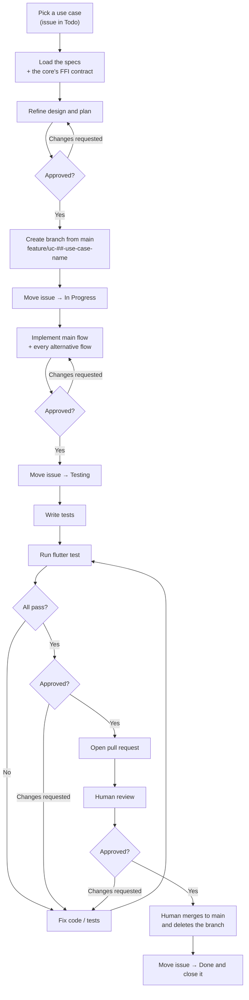

# Development Workflow Document — Alexandria Desktop

## 1. Purpose

This document defines **how a use case moves from backlog to merged** — the
branch, the issue status transitions, the testing gate, and the pull request. It
is the standard every contributor (human or agent) follows so that each use case
in the
[Use Case Specification Document](Use%20Case%20Specification%20Document.md) is
delivered the same way.

It complements the
[Testing Specification Document](Testing%20Specification%20Document.md), which
defines *how* the tests themselves are written; this document defines *when* they
happen in the delivery flow.

The operational, step-by-step form an implementer follows is
[`initial/Workflow.md`](../initial/Workflow.md). This document is its normative
formalization: same stages, same gates, same Definition of Done. Where the two
could be read as disagreeing, the approved `initial/Workflow.md` is correct and
this document is brought into line with it.

> **One use case = one branch = one issue = one pull request.**

## 2. Workflow at a glance



## 3. Issue status lifecycle

| Order | Status | Set when |
| --- | --- | --- |
| 1 | **Todo** | The use case has not been started (default). |
| 2 | **In Progress** | A branch has been created and implementation has begun. |
| 3 | **Testing** | Implementation is finished; tests are being written, run, and fixed until green. |
| 4 | **Done** | The pull request has been reviewed and merged; the issue is then **closed**. |

An issue only ever moves **forward** during normal flow. If review requests
changes, work continues on the same branch (still linked to the same issue) until
tests pass again and the pull request is re-reviewed.

## 4. Approval gates

The work is reviewed before it advances. Exactly one status change is made
unattended — `Todo → In Progress`, immediately after the branch is created —
because it signals that work has begun and reverses nothing.

| Gate | Before | What is shown |
| --- | --- | --- |
| 1 | Any code is written | The refined design and the step-by-step plan. |
| 2 | The issue moves to **Testing** | What was built, against the use case's flows. |
| 3 | The pull request is opened | The passing test results. |
| 4 | The issue moves to **Done** | Confirmation that the merge and branch deletion happened. |

Review, merge, and branch deletion are **human actions**. An agent may prepare and
push a pull request; it must never self-approve, merge, or delete the branch.

## 5. Step-by-step

### Step 1 — Load the specifications

Read the use case and everything it traces to before designing: the
[Use Case Specification Document](Use%20Case%20Specification%20Document.md) for
its flows, the
[System Requirements Document](System%20Requirements%20Document.md) for its
`FR-xx` requirements and the data and interface model, the
[Technology Stack Document](Technology%20Stack%20Document.md) for what to build
with, and this document for the process.

When the use case calls the Alexandria core, also read the corresponding contract
on the back-end side — the `alexandria-ffi` header and the back-end's own
requirements — because
[BR-02](../initial/Business%20Rules.md) forbids inventing a call the core does not
expose. A missing capability is back-end work, raised as such, not routed around.

### Step 2 — Refine the design and plan

Turn the specification into a concrete design for this codebase: the screens,
widgets, view models, gateway calls, and domain models involved; how each
alternative flow maps to a visible error or empty state; and how the screen
behaves across the breakpoints. Capture it as a written, step-by-step plan
sequenced test-first.

**Gate 1.** Present the design and plan; write no code until it is approved.

### Step 3 — Branch from the main branch

Every use case is implemented on its own branch, created from an up-to-date
`main`:

```bash
git switch main && git pull
git switch -c feature/uc-01-sign-up
```

**Branch naming pattern:**

```txt
feature/uc-##-use-case-name
```

| Use case | Branch |
| --- | --- |
| UC-01: Sign up | `feature/uc-01-sign-up` |
| UC-19: Play a video | `feature/uc-19-play-a-video` |
| UC-38: Navigate the application shell | `feature/uc-38-navigate-the-application-shell` |

### Step 4 — Move the issue to **In Progress**

As soon as the branch exists and work starts, set the issue `Status` to
**In Progress**. This is the one transition made without asking.

### Step 5 — Implement

Implement the main flow **and every alternative flow** from the specification,
following the project's architecture: feature-first layering, every outward
dependency behind an interface the domain layer owns, and file-type behavior
resolved through registration rather than type conditionals.

Two obligations apply to every commit, not to a cleanup pass at the end:

- Every user-visible string goes through the localization catalog, complete in
  both supported languages.
- Every color, spacing value, and text style comes from the theme, and each new
  screen is checked in both themes and across the breakpoints as it is built.

All commits go on the branch.

**Gate 2.** When the implementation is code-complete, stop and summarize what was
built. Only after approval, set the issue `Status` to **Testing**.

### Step 6 — Test until green

Following the
[Testing Specification Document](Testing%20Specification%20Document.md):

1. Write the tests for the main flow and each applicable `AF-xx` alternative flow.
2. Run the suite:

   ```bash
   flutter test
   ```

3. Fix any failures — in the implementation or in the tests.
4. Re-run, and repeat until every test passes.

A use case does not leave the Testing stage until the full suite is green.

**Gate 3.** Report the passing results and stop. Do not open a pull request yet.

### Step 7 — Open a pull request

Once approved, push the branch and open a pull request into `main`. The
description references the use case and its issue (e.g. `Closes #<issue-number>`)
and states which alternative flows were implemented and tested.

### Step 8 — Human review and merge

- The pull request is **reviewed by a human**. Requested changes are addressed on
  the same branch — back to Step 6 whenever code changes, so the suite stays
  green.
- Once approved, a human **merges** the pull request.
- The **branch is deleted** after the merge.

### Step 9 — Close the issue

**Gate 4.** After the merge and branch deletion, confirm and then set the issue
`Status` to **Done** and **close** it.

## 6. Definition of Done

A use case is done only when **all** of the following hold:

- [ ] Implemented on a `feature/uc-##-use-case-name` branch created from `main`.
- [ ] Main flow and every alternative flow from the specification are implemented.
- [ ] Every user-visible string is localized in both supported languages.
- [ ] The screens work in light and dark themes and across the supported window
      sizes, down to the minimum.
- [ ] Tests cover the use case per the Testing Specification.
- [ ] The full test suite passes (`flutter test`).
- [ ] A pull request was reviewed by a human and merged.
- [ ] The branch was deleted.
- [ ] The issue is in **Done** and closed.

## 7. References

- [`initial/Workflow.md`](../initial/Workflow.md) — the operational form of this process, and the authority where the two could differ.
- [Use Case Specification Document](Use%20Case%20Specification%20Document.md) — the use case definitions and their flows.
- [Testing Specification Document](Testing%20Specification%20Document.md) — how the tests are written.
- [System Requirements Document](System%20Requirements%20Document.md) — functional and non-functional requirements.
- [Technology Stack Document](Technology%20Stack%20Document.md) — technologies and versions used.
- [Operations & Infrastructure Document](Operations%20%26%20Infrastructure%20Document.md) — the platform the use cases are built on.
