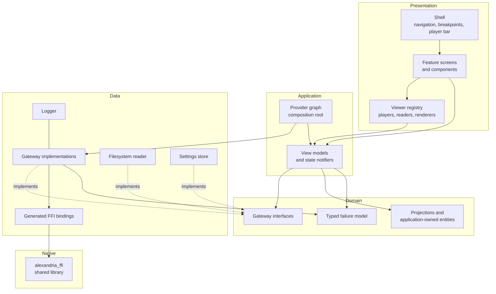

# Operations & Infrastructure Document — Alexandria UI

## 1. Introduction

### 1.1 Purpose

This document captures **cross-cutting platform concerns** for **Alexandria
UI** that fall outside the business domain modeled in the
[Vision Document](Vision%20Document.md),
[System Requirements Document](System%20Requirements%20Document.md), and
[Use Case Specification Document](Use%20Case%20Specification%20Document.md).

These are functional capabilities of the *platform* rather than the domain, so
they are documented here to keep the domain documents focused while still
tracking the work formally. The specific technologies and versions this platform
is built on are defined once in the
[Technology Stack Document](Technology%20Stack%20Document.md) and referenced from
here rather than duplicated.

### 1.2 Scope

- The technical foundation: solution architecture, repository layout, and the
  scaffolding every use case is built on.
- Loading and initializing the Alexandria core, and verifying it at startup.
- Configuration: what is configurable, and how it is supplied.
- Logging: what is recorded, where, and what is never recorded.
- Environments: how development, test, and release differ.
- Build and delivery: the pipeline and the packages it produces.

---

## 2. Technical Foundation

### 2.1 Overview

Alexandria UI is a single Flutter application with no server component. Its
foundation is a feature-first source tree over four layers, a provider graph that
is the single composition root, a generated binding layer over the Alexandria
core's C ABI, and the cross-cutting services — theme, localization, failure
mapping, logging, and local settings — that every feature consumes.

The foundation exists to make the use cases small. When it is in place, adding a
use case means adding a folder under `features/`, binding its gateway in the
provider graph, and registering any viewer it introduces. It should never mean
touching the shell, the bindings, or the error model.

### 2.2 Solution Architecture



The dependency rule the analyzer enforces: **Presentation and Application may not
import from Data.** They reach it only through the interfaces in Domain, bound in
the provider graph. Domain imports nothing outward at all.

### 2.3 Repository Layout

```txt
alexandria-ui/
├── README.md
├── LICENSE
├── analysis_options.yaml          layering and lint rules
├── pubspec.yaml
├── pubspec.lock                   committed; the real version pin
├── ffigen.yaml                    binding generation from the core's header.h
├── docs/
│   ├── initial/
│   └── requirements/
├── lib/
│   ├── main.dart                  entry point and bootstrap
│   ├── core/
│   │   ├── bindings/              generated FFI bindings (not hand-edited)
│   │   ├── di/                    the provider graph
│   │   ├── failures/              the typed failure model and its mapping
│   │   ├── l10n/                  ARB files and generated delegates
│   │   ├── logging/
│   │   ├── settings/              local settings store
│   │   └── theme/                 light and dark themes, breakpoints
│   └── features/
│       ├── auth/
│       ├── library_sources/
│       ├── catalog/
│       ├── editing/
│       ├── playback/
│       ├── viewers/
│       ├── organization/
│       ├── tracking/
│       ├── lifecycle/
│       └── shell/
├── native/                        the core's shared library per platform
├── test/
├── integration_test/
├── windows/
├── linux/
└── .github/workflows/
```

Each folder under `features/` holds `domain/`, `application/`, `data/`, and
`presentation/`.

### 2.4 Platform Requirements

| ID | Requirement |
| --- | --- |
| IR-01 | The solution shall be a Flutter application with the Windows and Linux desktop targets enabled and no other target configured. |
| IR-02 | The solution shall organize source code feature-first over the four layers, and shall enforce the dependency rule — Presentation and Application never importing Data — through analyzer rules that fail the build. |
| IR-03 | The solution shall generate its Alexandria core bindings from the core's published C header, shall commit the generated output, and shall never hand-edit it. |
| IR-04 | The solution shall bundle the Alexandria core's shared library for each target platform and load it at startup from a path resolved relative to the installed application. |
| IR-05 | The solution shall initialize the core with a database path in the per-platform application-support directory, creating the directory when absent. |
| IR-06 | The solution shall verify at startup that the loaded core reports a healthy status and a version the application supports, and shall present a readable failure with a retry when it does not. |
| IR-07 | The solution shall expose a single composition root through which every gateway interface is bound to its implementation, and which a test can override wholesale. |
| IR-08 | The solution shall define one typed failure model, mapping every status code the core can return to exactly one failure and every failure to exactly one localized message. |
| IR-09 | The solution shall free every string returned across the FFI boundary, including on failure paths, and shall run every core call off the interface thread. |
| IR-10 | The solution shall provide light and dark themes and the responsive breakpoints, as the single source of colors, spacing, and typography for every screen. |
| IR-11 | The solution shall provide the localization infrastructure for `pt-BR` and `en`, and shall fail the build when a key is missing from either. |
| IR-12 | The solution shall provide the local settings store, holding no credential and no catalog data. |
| IR-13 | The solution shall write a rolling local log file in release builds, containing no credential, no session material, and no file content. |
| IR-14 | The solution shall provide the three test suites, the shared fakes, and the fixture-library and temporary-database helpers the Testing Specification requires. |
| IR-15 | The solution shall run analysis, the unit and widget suite, and the integration suite on both target platforms in continuous integration, and shall fail on any analyzer warning. |
| IR-16 | The solution shall produce, from the same pipeline, an MSIX package and an installer executable for Windows and an AppImage, a `.deb`, and a Flatpak for Linux, each bundling the core's shared library. |

---

## 3. Configuration

The application is configured for the machine it runs on, not for a deployment
environment. There is no server, no connection string, and no secret to inject.

| Concern | Mechanism | Notes |
| --- | --- | --- |
| Catalog database path | Application-support directory, overridable by a `--dart-define` at build time and by an environment variable at run time | Development and integration tests point it at a temporary directory so no run touches a real catalog. |
| Alexandria core library path | Resolved relative to the installed application, overridable by an environment variable | The override exists for development against a locally built core. |
| Core configuration | The core's own configuration mechanism, which it loads itself | The application does not parse or duplicate the core's configuration; it passes the database path and lets the core resolve the rest, so a setting means the same thing on both sides. |
| Log level | `--dart-define` at build time | Verbose in development, informational in release. |
| Log file location | Application-support directory | See §4. |
| Owner preferences — theme, language, layout, sort, filters, library folders, window geometry | The local settings store | Owner-facing state, changed in the interface, never in a config file. |
| Music enrichment — whether lookups may run, and the contact they carry | The local settings store, applied to the core's `ALEXANDRIA_METADATA_*` variables before it is initialized | The core's own setting, but the owner's decision: this application embeds the core, so the owner *is* the operator, and asking them to edit a `config.toml` to see a lyric would be asking them to administer their own music player. |

| The core's caches — artist photographs and thumbnails | Set to directories beside the catalog, through `ALEXANDRIA_METADATA_IMAGE_CACHE_DIR` and `ALEXANDRIA_PLAYBACK_THUMBNAIL_CACHE_DIR`, before the core is initialized | Both settings default to a path relative to the process's working directory, which for an installed application is wherever the desktop started it — a directory this application does not own and often cannot write to. The catalog's own directory is the one it does. |

No secret is ever written into this document, into the repository, or into a
build argument. The only credential in the product is the owner's password, which
the application forwards to the core and never stores.

---

## 4. Logging & Monitoring

There is no aggregator and no telemetry: this is a local application, and nothing
it records leaves the machine. That is unchanged by music enrichment, which is
outbound only and carries no log, no counter, and nothing identifying the owner
or their library — an artist name, a track title, an album name and a duration,
and only while the owner has it switched on, and only when they ask for a
lookup.

| Concern | Approach |
| --- | --- |
| Format | Structured records — timestamp, level, feature, message, and context fields. |
| Destination in development | The console. |
| Destination in release | A rolling file in the application-support directory, capped in size and count so it cannot grow without bound. |
| Levels used | `severe` for a failure the owner sees, `warning` for a recovered failure, `info` for lifecycle events — startup, core initialization, session established, index run started and settled — and `fine` for diagnostic detail in development only. |
| Never logged | Passwords, session credentials, file contents, and the personal contents of metadata fields. A file is identified in a log by its UUID, not by its path or name. |
| Failure records | Every failure presented to the owner is logged once, with the core's status code, so a report can be traced without the owner reading a code on screen. |

Monitoring, in a local desktop application, means the startup health check in §5
and the log file. There is nothing to scrape and no uptime to observe.

---

## 5. Core Availability & Startup Checks

The application has no runtime endpoint to probe — it is not a service. Its
equivalent is the **startup verification of the Alexandria core**, which is the
one point where the application can discover that its only dependency is not
usable, and must say so rather than crashing.

### 5.1 Startup sequence

| Order | Step | Failure behavior |
| --- | --- | --- |
| 1 | Resolve and load the core's shared library | Present "the Alexandria core could not be loaded", with the path attempted and a retry. |
| 2 | Resolve the application-support directory and the database path | Present the directory that could not be created, with a retry. |
| 3 | Load the local settings and apply the theme and language | Fall back to system theme and language — and, for the core's own configuration below, to the shipped defaults — and report that preferences could not be read. |
| 4 | Initialize the core against the database path, with the owner's music-lookup choice | Present the core's reported reason, with a retry. |
| 5 | Read the core's version and health status | Present an incompatible-version or unhealthy-core message, with a retry. |
| 6 | Determine whether an account exists, and present sign-up or login | Present the core's reason, with a retry. |
| 7 | After signing up, present the recovery codes the core minted | Present the core's reason, with a retry. An account created without codes is said so plainly, and regenerating a set is offered. |

The settings are read **before** the core is initialized, and that order is
load-bearing rather than incidental. The core reads its own configuration
exactly once, at `alexandria_index_init`, and one of those settings — whether
music enrichment may run, and the contact it identifies itself with — is the
owner's to make in the preferences dialog. Loading preferences after
initialization would leave every such choice a launch behind the owner who
made it. A choice changed *during* a session is applied by initializing the
core again against the same database, which the core documents as safe and
which leaves the session (held in the database, not in the process) intact.

### 5.2 Health contract

The core reports its health as a status code and its version as a string. The
application treats them as follows:

| Condition | Application state |
| --- | --- |
| Health status is the success code and the version is supported | Startup proceeds. |
| Health status is any other code | `CoreUnavailable`, with the code mapped to a readable message and a retry. |
| The version is outside the supported range | `CoreUnavailable`, stating the version found and the version required. |
| The library cannot be loaded at all | `CoreUnavailable`, stating the path that was attempted. |

`CoreUnavailable` is a first-class application state, not an error dialog over a
broken window: no catalog call is attempted from it, and the retry re-runs the
sequence from step 1.

### 5.3 Relationship to the domain use cases

The startup sequence is not a use case — it has no owner-initiated flow. Its
owner-visible outcomes are specified where the owner meets them: the
core-unavailable state and its retry in
[UC-38 AF-04](Use%20Case%20Specification%20Document.md), the branch between
sign-up and login in UC-01 and UC-02, and the locked-catalog branch in UC-40. The
sequence itself is platform work, tracked by `IR-04` through `IR-06`.

---

## 6. Environments

| Environment | Purpose | Differences |
| --- | --- | --- |
| **Development** | Building and debugging on a maintainer's machine | Verbose logging to console; the core library and database paths overridable to a locally built core and a scratch database; hot reload available. |
| **Test — unit and widget** | The fast suite, run on every change | No native library loaded at all; every gateway faked; the settings store in memory; a temporary directory for anything that must exist on disk. |
| **Test — integration** | Verifying the real FFI boundary | The real core, a temporary SQLite database, and a generated fixture library folder, all created per run and removed afterwards. Never a real library folder. |
| **Release** | The packaged application the owner installs | Informational logging to the rolling file; the bundled core library; the real application-support directory; no override honored except the documented ones. |

The **reference machine** for the performance targets in
[System Requirements §6](System%20Requirements%20Document.md) is an ordinary
desktop of the class the product targets: a four-core x64 processor, 8 GB of RAM,
an SSD, and integrated graphics, running a release build over a reference library
of 20,000 cataloged files. Targets are measured there; a faster machine is not
evidence that a target is met.

---

## 7. Build & Delivery

### 7.1 Continuous integration

Every pull request runs the pipeline on both platforms. A warning fails the build
— there is no "known warnings" list, because the moment there is one, warnings
stop being read.

| Stage | Runs | Fails on |
| --- | --- | --- |
| Generate | `build_runner`, including the FFI bindings from the core's header | Generated output differing from what is committed. |
| Analyze | The analyzer with the project's rules | Any warning or error, including a layering violation. |
| Localization check | Both ARB catalogs | Any key present in one language and absent from the other. |
| Test | The unit and widget suite, with coverage | Any failing test. |
| Integration test | The integration suite on a Windows runner and an Ubuntu runner | Any failing test on either platform. |
| Build | A release build for Windows and for Linux | Either platform failing to build. |

### 7.2 Packaging

Packages are produced from the same pipeline on a tagged release, each bundling
the Alexandria core's shared library for its platform:

| Platform | Packages |
| --- | --- |
| Windows | An MSIX package and an installer executable. |
| Linux | An AppImage, a `.deb`, and a Flatpak. |

**Deferred decision — signing.** Code signing for the Windows packages requires a
certificate the project does not yet hold, and Flatpak distribution through a
public remote requires an account that does not yet exist. Both are recorded here
as deliberately deferred, to be settled before the first public release; until
then, packages are produced unsigned and published as build artifacts. Neither
blocks any use case.

### 7.3 What is not delivered

No installer, updater, or package in this project ever installs, updates, or
launches a *service*. The Alexandria core travels inside the application bundle as
a library. There is nothing to run in the background, nothing to open a port, and
nothing to uninstall separately.

---

## 8. Traceability

| Platform capability | Requirements |
| --- | --- |
| Project scaffold and target configuration | IR-01 |
| Feature-first layering and its enforcement | IR-02 |
| Alexandria core bindings and library loading | IR-03, IR-04 |
| Core initialization and startup verification | IR-05, IR-06 |
| Composition root and dependency binding | IR-07 |
| Typed failure model and its mapping | IR-08 |
| FFI memory and threading discipline | IR-09 |
| Theming and responsive breakpoints | IR-10 |
| Localization infrastructure | IR-11 |
| Local settings store | IR-12 |
| Logging | IR-13 |
| Test infrastructure | IR-14 |
| Continuous integration | IR-15 |
| Packaging for both platforms | IR-16 |

These `IR-xx` requirements are the Definition of Done for the foundation issue in
the [README](../../README.md) backlog. They are not use cases and are not split
into separate issues: their whole purpose is to give the use-case issues somewhere
to land.
