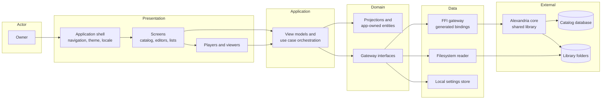
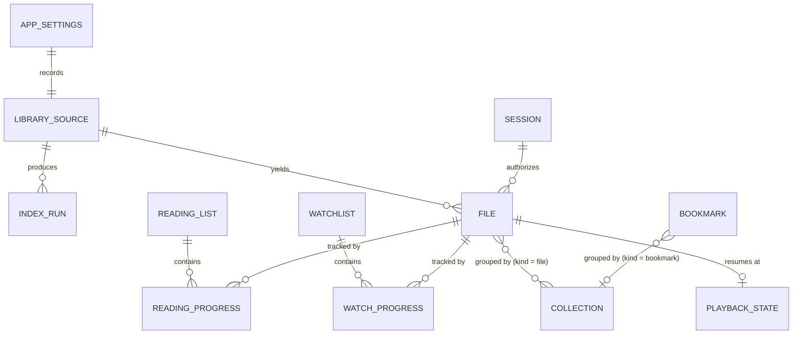
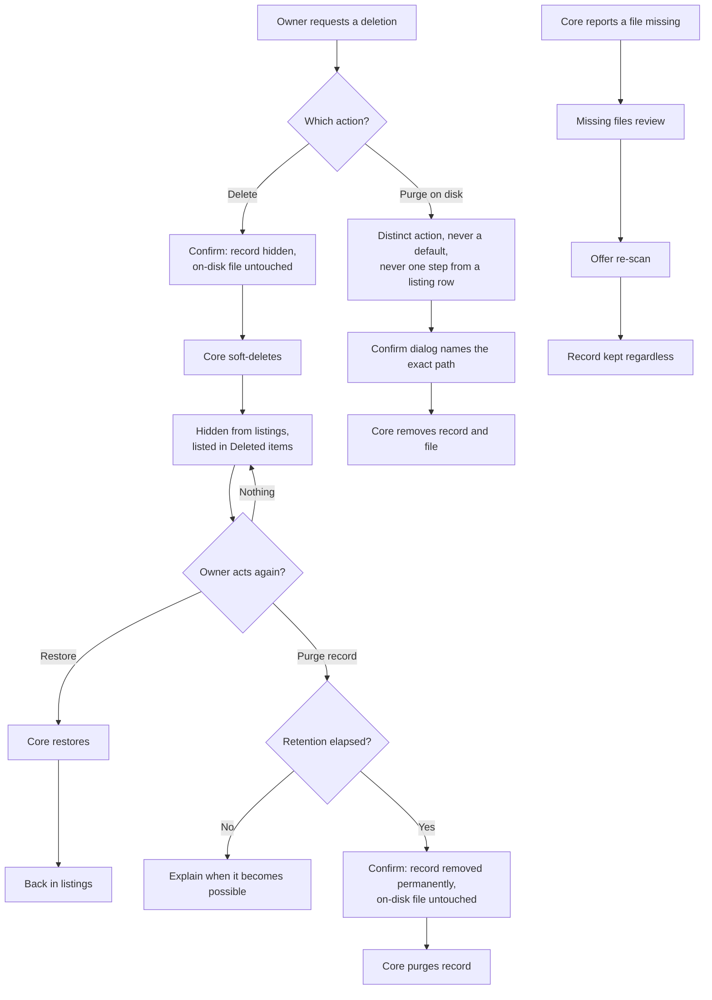

# System Requirements Document — Alexandria Desktop

## 1. Introduction

### 1.1 Purpose

This document specifies the functional and non-functional requirements for
**Alexandria Desktop**.

The concrete technology stack — platform and language versions, libraries, local
storage, and tooling — is defined in the
[Technology Stack Document](Technology%20Stack%20Document.md). This document
states requirements and refers to that one for specific technologies and versions
rather than restating them.

Two boundaries shape every requirement below and are stated once here rather than
repeated in each row:

1. **The Alexandria core owns the catalog.** Where a requirement says the
   application shall create, update, or delete catalog data, it does so *through
   the core's FFI surface*. The application never writes catalog state itself and
   never implements a rule the core already enforces.
2. **The disk is read directly for bytes only.** Playback and viewing read the
   file at the path the core reports. Every other interaction with a file — its
   record, its name, its metadata, its lifecycle — goes through the core.

### 1.2 Scope

The application covers authentication and session handling; registering and
indexing library folders; browsing, searching, filtering, and sorting the
catalog; playing audio and video; viewing documents, comic books, images, and
saved HTML pages; editing music and video metadata, file names, and Markdown and
text content; organizing files and bookmarks into collections; tracking
watchlists and reading lists with per-episode and per-issue progress; carrying
out the core's two-phase deletion lifecycle including the separate purge-on-disk;
and the application shell that hosts all of it — responsive layout, light and
dark themes, Brazilian Portuguese and English, and consistent loading, error, and
confirmation presentation.

### 1.3 Definitions

Domain nouns are defined once in
[Vision Document §1.3](Vision%20Document.md). The terms below are specific to
this document.

| Term | Definition |
| --- | --- |
| **Gateway** | The abstract interface, declared in the domain layer, through which a domain area reaches the Alexandria core. One per area; implemented once over the generated FFI bindings. |
| **Typed failure** | A member of the application's failure union. Every core status code maps to exactly one, and every one maps to a localized message. |
| **Projection** | An in-memory model of a core-owned entity. Displayed and edited through core calls; never treated as authoritative. |
| **Viewer registry** | The registration table binding a file type to the component that presents it. |
| **Breakpoint** | A window-width threshold at which the shell changes layout. |
| **Session credential** | The material the core returns on successful login, presented on every subsequent call. Held in memory only. |
| **Unacknowledged session** | An authenticated session whose new account's recovery codes are still on screen. It reaches the acknowledgement and sign-out, and nothing else. |
| **Confirmation code** | The value the core sends to the account's e-mail to prove the owner controls it. Submitted once, never stored. |
| **Reset token** | The value the core sends to the account's e-mail to authorize replacing the password. Submitted once, never stored. |
| **Perceptible operation** | Any operation that may take longer than 150 ms — every core call, every disk read, and every media load. |

---

## 2. System Overview

The single arrow worth noting is the one that is **absent**: nothing in
Presentation or Application reaches Data directly. Every outward dependency
crosses a gateway interface the Domain layer owns, which is what lets the whole
application run against fakes in tests and what would let an HTTP implementation
replace the FFI one without touching a screen.

---

## 3. Functional Requirements

### 3.1 Authentication and Session — `AU`

| ID | Requirement |
| --- | --- |
| FR-AU-01 | The system shall determine at launch whether an account already exists in the core, and present the sign-up screen when it does not. |
| FR-AU-02 | The system shall create the owner's account through the core with an e-mail and a password, requiring the password to be entered twice and matching before the call is made. |
| FR-AU-03 | The system shall reject a malformed e-mail address or an empty password before calling the core, and shall present the core's verdict as final when the call is made. |
| FR-AU-04 | The system shall authenticate the owner through the core's local-login operation using the e-mail and password entered. |
| FR-AU-05 | The system shall hold the session credential returned by the core in process memory only, for the duration of the application run. |
| FR-AU-06 | The system shall present the current session credential on every core call that requires one. |
| FR-AU-07 | The system shall present the login screen and issue no catalog call whenever there is no active session. |
| FR-AU-08 | The system shall return the owner to the login screen, stating the reason, when the core rejects a call as unauthorized. |
| FR-AU-09 | The system shall sign the owner out on request, discarding the session credential and stopping any active playback. |
| FR-AU-10 | The system shall allow the owner to change the stored credentials while a session is active, requiring the new password to be entered twice. |
| FR-AU-11 | The system shall never write a plaintext password, a session credential, or a recovery code to disk, to a log, or to any diagnostic output. |
| FR-AU-12 | The system shall present the recovery codes the core returns exactly once, in place of the catalog, and shall require the owner to acknowledge having stored them before the catalog is reached. |
| FR-AU-13 | The system shall never store a recovery code, and shall offer no way to see a set again once it has been dismissed. |
| FR-AU-14 | The system shall report how many recovery codes remain unconsumed, as the core reports it. |
| FR-AU-15 | The system shall replace a forgotten password through the core with a recovery code and a new password entered twice and matching, without an active session. |
| FR-AU-16 | The system shall present a rejected recovery code as a readable explanation that distinguishes one the core does not recognise from one already consumed. |
| FR-AU-17 | The system shall replace the whole recovery-code set through the core on the authenticated owner's request, after a confirmation stating that every existing code stops working. |
| FR-AU-18 | The system shall discard the active session and return to the login screen when a password is replaced through a recovery code. |
| FR-AU-19 | The system shall neither generate, validate, nor consume a recovery code itself, and shall neither count what remains nor decide when a set should be replaced. |

### 3.2 Library Sources and Indexing — `LB`

| ID | Requirement |
| --- | --- |
| FR-LB-01 | The system shall allow the owner to register a library folder chosen through the platform's native folder picker. |
| FR-LB-02 | The system shall reject a folder that does not exist, cannot be read, or is already registered, stating which condition failed. |
| FR-LB-03 | The system shall persist the registered library folders locally, so they survive a restart. |
| FR-LB-04 | The system shall support any number of registered library folders and present their files as one merged catalog. |
| FR-LB-05 | The system shall start an index run for a chosen library folder and retain the run identifier the core returns. |
| FR-LB-06 | The system shall start a refresh run covering everything already cataloged, independently of any single folder. |
| FR-LB-07 | The system shall observe a run's progress without blocking the interface, leaving browsing, playback, viewing, and editing available while it runs. |
| FR-LB-08 | The system shall present the outcome of a finished run — files added, files updated, and files found missing — and shall keep that summary visible until the owner dismisses it. |
| FR-LB-09 | The system shall prevent a second index run from being started for a library folder while a run for that folder is in flight. |
| FR-LB-10 | The system shall allow the owner to unregister a library folder after a confirmation stating that catalog records and on-disk files are left untouched. |
| FR-LB-11 | The system shall present first-run guidance directing the owner to register a library folder whenever no folder is registered. |

### 3.3 Catalog Browsing and Search — `CT`

| ID | Requirement |
| --- | --- |
| FR-CT-01 | The system shall present a navigation panel listing every file type in the library — music, videos, books, comic books, notes and text files, HTML pages, and images — plus bookmarks, with the count of items in each. Corrected in UC-09: this originally listed movies and series separately, but the core classifies a file as `video` and carries no subtype, so the two would be the same query returning the same rows. That distinction is a watchlist's (UC-29), not the catalog's. Bookmarks are not files and are listed through their own core call (UC-28). |
| FR-CT-02 | The system shall list the files of a selected type, retrieved from the core. |
| FR-CT-03 | The system shall offer three view layouts — list, list with details, and grid — and switch between them on request. |
| FR-CT-04 | The system shall remember the chosen layout per file type across restarts. |
| FR-CT-05 | The system shall present a detail view for a single file showing its type-specific metadata, its path, and its lifecycle state. |
| FR-CT-06 | The system shall search the catalog by file name and by type-specific metadata, and present matches across every type. |
| FR-CT-07 | The system shall filter the listed items by type, lifecycle state, containing collection, and the type-specific attributes the core exposes. |
| FR-CT-08 | The system shall sort the listed items by name, by date, and by the type-specific attributes the core exposes. |
| FR-CT-09 | The system shall present an empty-result state that is visually distinct from a loading state and from an error state. |
| FR-CT-10 | The system shall render long catalog listings without materializing every row, so that scrolling cost does not grow with the size of the library. |
| FR-CT-11 | The system shall present a home dashboard showing recently added items, items in progress in watchlists and reading lists, per-type counts, and the outcome of the most recent index run. |
| FR-CT-12 | The system shall open the viewer or player registered for a file's type from any listing or from the detail view. |

### 3.4 Metadata and Content Editing — `ME`

| ID | Requirement |
| --- | --- |
| FR-ME-01 | The system shall edit an audio file's music metadata through the core. |
| FR-ME-02 | The system shall edit a video file's metadata through the core, including whether it is a movie or a series. |
| FR-ME-03 | The system shall validate editable fields before the call for immediate feedback, and shall present the core's rejection as final when it disagrees. |
| FR-ME-04 | The system shall rename any file through the core, rejecting names containing characters the host operating system forbids before the call is made. |
| FR-ME-05 | The system shall reflect a completed rename or metadata edit in every open listing and detail view without requiring a manual refresh. |
| FR-ME-06 | The system shall read a text or Markdown file's content through the core for editing. |
| FR-ME-07 | The system shall present a Markdown and text editor with a live rendered preview alongside the source. |
| FR-ME-08 | The system shall write edited content back through the core only when it differs from the content that was loaded. |
| FR-ME-09 | The system shall warn the owner before discarding unsaved editor changes. |
| FR-ME-10 | The system shall report a disk failure reported by the core without altering the content shown in the editor. |

### 3.5 Media Playback — `PL`

| ID | Requirement |
| --- | --- |
| FR-PL-01 | The system shall play a video file from its on-disk path without transcoding it. |
| FR-PL-02 | The system shall offer full-screen toggling, pause and resume, and seeking forward and backward during video playback. |
| FR-PL-03 | The system shall list the subtitle tracks available in a video and switch between them, including turning subtitles off. |
| FR-PL-04 | The system shall list the audio tracks available in a video and switch between them. |
| FR-PL-05 | The system shall play an audio file from its on-disk path in a player that remains available while the owner navigates elsewhere in the application. |
| FR-PL-06 | The system shall queue the tracks of an album or an artist for continuous playback, and allow skipping within the queue. |
| FR-PL-07 | The system shall display, for the duration of album or artist playback, an animation of a disc, vinyl record, or tape on its matching player, which turns while audio plays and stops while it is paused. |
| FR-PL-08 | The system shall keep at most one playback session active, stopping video playback when audio starts and the reverse. |
| FR-PL-09 | The system shall persist a resume position for a played file and offer to resume from it when the file is opened again. |
| FR-PL-10 | The system shall report a file that is missing on disk or cannot be decoded as a readable failure, without terminating the application. |

### 3.6 Document, Image, and Page Viewing — `VW`

| ID | Requirement |
| --- | --- |
| FR-VW-01 | The system shall resolve the component that presents a file from a registry keyed by file type, so that adding a type or replacing a viewer is a registration rather than a change to the listing or detail screens. |
| FR-VW-02 | The system shall present PDF and e-book documents with page or chapter navigation and a remembered reading position. |
| FR-VW-03 | The system shall present a comic book page by page, reading pages from the archive without extracting it to disk. |
| FR-VW-04 | The system shall present an image with fit-to-window and zoom controls. |
| FR-VW-05 | The system shall render a saved HTML page as displayed content without executing any script it contains. |
| FR-VW-06 | The system shall present a Markdown file as rendered content when it is opened for reading rather than for editing. |
| FR-VW-07 | The system shall read a file's bytes at the moment it is opened and shall not retain them across application runs. |
| FR-VW-08 | The system shall report a file type with no registered viewer, or a viewer whose dependency is unavailable, as a readable failure that offers the file's other actions. |

### 3.7 Collections and Bookmarks — `OG`

| ID | Requirement |
| --- | --- |
| FR-OG-01 | The system shall create a collection of a chosen kind — file or bookmark — through the core. |
| FR-OG-02 | The system shall rename a collection through the core. |
| FR-OG-03 | The system shall delete a collection through the core, after a confirmation stating that its contained items are preserved and only the grouping is removed. |
| FR-OG-04 | The system shall add one or more items to a collection of the matching kind through the core. |
| FR-OG-05 | The system shall remove an item from a collection through the core, leaving the item itself in the catalog. |
| FR-OG-06 | The system shall list the members of a collection through the core. |
| FR-OG-07 | The system shall present collection navigation — listing, breadcrumbs, and moving an item between collections — against a hierarchical model whose present depth is one, so that nested collections become a change of data rather than of interface. |
| FR-OG-08 | The system shall create a browser bookmark with a URL, a title, and an optional bookmark collection, through the core. |
| FR-OG-09 | The system shall update a bookmark's URL, title, and containing collection through the core. |
| FR-OG-10 | The system shall list bookmarks, optionally filtered by their containing collection. |
| FR-OG-11 | The system shall open a bookmark's URL in the platform's default browser. |
| FR-OG-12 | The system shall reject a URL that does not parse, and a blank title, before calling the core. |

### 3.8 Watchlists and Reading Lists — `TR`

| ID | Requirement |
| --- | --- |
| FR-TR-01 | The system shall create a named watchlist through the core. |
| FR-TR-02 | The system shall delete a watchlist through the core, after a confirmation stating that the videos themselves are preserved. |
| FR-TR-03 | The system shall add a video to a watchlist through the core, and shall offer that action only for video files. |
| FR-TR-04 | The system shall remove a video from a watchlist through the core. |
| FR-TR-05 | The system shall list watchlists together with each item's watch state and progress. |
| FR-TR-06 | The system shall update an item's watch state through the core across the states the core defines. |
| FR-TR-07 | The system shall record and present per-episode progress for an item marked as a series, and single-item progress for a movie. |
| FR-TR-08 | The system shall create a named reading list through the core. |
| FR-TR-09 | The system shall delete a reading list through the core, after a confirmation stating that the books and comics themselves are preserved. |
| FR-TR-10 | The system shall add a book document or a comic book to a reading list through the core, and shall offer that action only for those file types. |
| FR-TR-11 | The system shall remove an item from a reading list through the core. |
| FR-TR-12 | The system shall list reading lists together with each item's read state and progress. |
| FR-TR-13 | The system shall update an item's read state through the core across the states the core defines. |
| FR-TR-14 | The system shall record and present per-issue progress for a comic that belongs to a series, and single-item progress for a standalone book. |

### 3.9 Deletion Lifecycle — `LC`

| ID | Requirement |
| --- | --- |
| FR-LC-01 | The system shall soft-delete a file or bookmark through the core, after a confirmation stating explicitly that the on-disk file is not affected. |
| FR-LC-02 | The system shall exclude soft-deleted records from the default listings. |
| FR-LC-03 | The system shall present a view of soft-deleted records, showing for each how long it remains restorable. |
| FR-LC-04 | The system shall restore a soft-deleted record through the core and return it to the default listings. |
| FR-LC-05 | The system shall purge a soft-deleted record through the core after a confirmation stating that the record is removed permanently and the on-disk file is not. |
| FR-LC-06 | The system shall present purge-on-disk as an action distinct from every other deletion: never the default action, never reachable in a single interaction from a listing row, and confirmed by a dialog naming the exact file path to be deleted. |
| FR-LC-07 | The system shall present the core's rejection of a purge attempted before its retention window elapsed as a readable explanation of when it becomes possible. |
| FR-LC-08 | The system shall present files the core reports as missing on disk in a dedicated review, offering a re-scan, and shall never delete a record because its file is missing. |
| FR-LC-09 | The system shall refresh every affected listing, counter, and detail view after any lifecycle change completes. |

### 3.10 Application Shell, Theming, and Localization — `UX`

| ID | Requirement |
| --- | --- |
| FR-UX-01 | The system shall present a single-window shell comprising the type navigation panel, the content area, and the persistent playback bar. |
| FR-UX-02 | The system shall adapt the shell across the defined width breakpoints, collapsing the navigation panel rather than clipping or hiding any control. |
| FR-UX-03 | The system shall enforce the minimum supported window size and shall persist and restore the window's size and position across runs. |
| FR-UX-04 | The system shall offer light, dark, and system-matching themes, applying a change immediately without restarting. |
| FR-UX-05 | The system shall offer Brazilian Portuguese and English, applying a change immediately without restarting. |
| FR-UX-06 | The system shall present every user-visible string from the localization catalog, complete in both supported languages. |
| FR-UX-07 | The system shall derive every color, spacing value, and text style from the active theme rather than from a literal declared in a component. |
| FR-UX-08 | The system shall present a loading state for every perceptible operation. |
| FR-UX-09 | The system shall present every failure as a localized, human-readable message derived from the core's status code, never as a raw status code and never as a silent no-operation. |
| FR-UX-10 | The system shall confirm every destructive action through a modal that names what will be removed and whether the on-disk file is affected. |
| FR-UX-11 | The system shall make the primary action of every screen reachable from the keyboard. |
| FR-UX-12 | The system shall persist the owner's theme, language, layout, sort, and filter preferences locally and restore them at launch. |

---

## 4. Data Model

### 4.0 Identifier Strategy

The application introduces **no identifier of its own** for any core-owned
entity. Every file, collection, bookmark, watchlist, and reading list is
addressed by the **public UUID string** the core returns, and that UUID is what
every call passes back. The core's internal keys are never exposed across the FFI
boundary and consequently never exist in this application.

The application's own entities are keyed by what naturally identifies them: a
`LibrarySource` by its absolute folder path, an `IndexRun` by the run identifier
the core returned when it started, and `AppSettings` by being a singleton. A
`PlaybackState` is keyed by the file UUID it belongs to, which means a purged
file's resume point is identifiable and removable.

### 4.1 Entity Relationship Diagram

`FILE`, `BOOKMARK`, `COLLECTION`, `WATCHLIST`, `WATCH_PROGRESS`, `READING_LIST`,
and `READING_PROGRESS` are **projections** of core-owned entities; the field
tables below list what the application consumes from each, not what the core
stores. `LIBRARY_SOURCE`, `INDEX_RUN`, `SESSION`, `PLAYBACK_STATE`, and
`APP_SETTINGS` are owned by the application and persisted — except `SESSION` —
in the local settings store.

### 4.2 File (projection)

| Field | Type | Constraints | Description |
| --- | --- | --- | --- |
| uuid | string | Required, from the core | The public identifier passed on every call about this file. |
| name | string | Required, editable | The file name on disk. |
| path | string | Required, read-only | The absolute on-disk path. Used to read bytes for playback and viewing. |
| type | enum | Required | The file's type, which selects the viewer and the available actions. |
| state | enum | Required | The lifecycle state the core reports — active, deleted, or missing. |
| contentHash | string | Required, read-only | The core's content hash. Used to detect that a file changed since it was listed. |
| metadata | type-specific | Optional | The subtype metadata the core returns for this file's type, edited through the core. |
| deletedAt | timestamp | Present when deleted | Drives the remaining-restorable indication in the deleted view. |

### 4.3 Bookmark (projection)

| Field | Type | Constraints | Description |
| --- | --- | --- | --- |
| uuid | string | Required, from the core | Public identifier. |
| url | string | Required, must parse as a URL | The target opened in the default browser. |
| title | string | Required, non-empty | The label shown in listings. |
| collectionUuid | string | Optional | The bookmark collection containing it, if any. |
| state | enum | Required | Lifecycle state, as for a file. |

### 4.4 Collection (projection)

| Field | Type | Constraints | Description |
| --- | --- | --- | --- |
| uuid | string | Required, from the core | Public identifier. |
| name | string | Required, non-empty after trimming | Display name. |
| kind | enum | Required — file or bookmark | Determines which items may be added. |
| itemCount | integer | Derived | Shown in listings; recomputed after membership changes. |

### 4.5 Watchlist and WatchProgress (projections)

| Field | Type | Constraints | Description |
| --- | --- | --- | --- |
| watchlist.uuid | string | Required | Public identifier. |
| watchlist.name | string | Required, non-empty | Display name. |
| progress.videoUuid | string | Required | The video this progress belongs to. |
| progress.state | enum | Required | The watch state the core defines. |
| progress.currentEpisode | integer | Optional, series only | Current episode for a series. |
| progress.totalEpisodes | integer | Optional, series only | Total episodes, when known. |

### 4.6 ReadingList and ReadingProgress (projections)

| Field | Type | Constraints | Description |
| --- | --- | --- | --- |
| readingList.uuid | string | Required | Public identifier. |
| readingList.name | string | Required, non-empty | Display name. |
| progress.itemUuid | string | Required | The book or comic this progress belongs to. |
| progress.state | enum | Required | The read state the core defines. |
| progress.currentIssue | integer | Optional, comic series only | Current issue. |
| progress.totalIssues | integer | Optional, comic series only | Total issues, when known. |

### 4.7 LibrarySource (application-owned)

| Field | Type | Constraints | Description |
| --- | --- | --- | --- |
| path | string | Required, unique, an existing readable directory at registration | The registered library folder. Also its key. |
| label | string | Optional | An owner-supplied name, defaulting to the folder name. |
| registeredAt | timestamp | Required | When it was registered. |
| lastRunId | string | Optional | The identifier of the most recent run over this folder. |
| lastRunOutcome | enum | Optional | Whether that run finished or failed. |
| lastRunAt | timestamp | Optional | When it finished. |

### 4.8 IndexRun (application-owned)

| Field | Type | Constraints | Description |
| --- | --- | --- | --- |
| runId | string | Required, from the core | The run identifier the core returned. |
| kind | enum | Required — scan or refresh | Which operation started it. |
| sourcePath | string | Required for a scan | The library folder being scanned. |
| status | enum | Required — running, finished, failed | Observed state. |
| filesIndexed | integer | Derived | Files counted so far. |
| filesMissing | integer | Derived | Cataloged files found missing. |
| startedAt | timestamp | Required | When it started. |

### 4.9 Session (application-owned, memory only)

| Field | Type | Constraints | Description |
| --- | --- | --- | --- |
| credential | string | Required while authenticated | The material the core returned at login. Never persisted, never logged. |
| establishedAt | timestamp | Required | When the session began. |
| recoveryCodesRemaining | integer | Optional | How many recovery codes the core reports as unconsumed, shown where the owner can act on it (`FR-AU-14`). Absent when the core does not report it, which is a missing number and not a zero. |
| email | string | Required | The account's address, shown in the account section of preferences. |

A confirmation code and a reset token are deliberately **absent** from this table
and from every other: they exist only as arguments to the call that submits them
(`FR-AU-18`).

### 4.10 PlaybackState (application-owned)

| Field | Type | Constraints | Description |
| --- | --- | --- | --- |
| fileUuid | string | Required, key | The file this resume point belongs to. |
| positionMs | integer | Required, ≥ 0 | Where playback stopped. |
| durationMs | integer | Optional | Total duration, when the engine reported it. |
| updatedAt | timestamp | Required | When it was last written. |

### 4.11 AppSettings (application-owned, singleton)

| Field | Type | Constraints | Description |
| --- | --- | --- | --- |
| theme | enum | Required — system, light, dark | Active theme. |
| language | enum | Required — pt-BR, en | Active language. |
| layoutByType | map | Required | The chosen view layout per file type. |
| sortByType | map | Optional | The chosen sort per file type. |
| filtersByType | map | Optional | The retained filters per file type. |
| librarySources | list | Required | The registered library folders. |
| windowGeometry | record | Optional | Last window size and position. |

---

## 5. Interface Surface

The application has two interface surfaces: outward to the owner (screens) and
inward to the Alexandria core (calls). Neither introduces an operation the core
does not already publish.

### 5.1 Screen Surface

| Screen | Purpose | Requirements |
| --- | --- | --- |
| Sign-up | Create the single account with an e-mail and password | FR-AU-01, FR-AU-02, FR-AU-03 |
| Recovery codes | Present a new set once, and take the owner's acknowledgement | FR-AU-12, FR-AU-13 |
| Login | Authenticate the owner | FR-AU-04, FR-AU-05, FR-AU-07 |
| Password recovery | Spend a recovery code on a new password | FR-AU-15, FR-AU-16, FR-AU-18 |
| Home dashboard | Recent items, items in progress, counts, last run outcome | FR-CT-11 |
| Library sources | Register, scan, refresh, and unregister folders | FR-LB-01 … FR-LB-11 |
| Catalog listing | Type-filtered listing in three layouts, with search, filters, and sorting | FR-CT-01 … FR-CT-04, FR-CT-06 … FR-CT-10, FR-CT-12 |
| File detail | Metadata, path, state, and available actions | FR-CT-05, FR-ME-01, FR-ME-02, FR-ME-04 |
| Text editor | Markdown and text editing with live preview | FR-ME-06 … FR-ME-10 |
| Video player | Playback with subtitle and audio tracks | FR-PL-01 … FR-PL-04, FR-PL-08 … FR-PL-10 |
| Audio player | Persistent playback with queue and album animation | FR-PL-05 … FR-PL-10 |
| Document viewer | PDFs and e-books | FR-VW-02, FR-VW-07, FR-VW-08 |
| Comic viewer | Comic archives, page by page | FR-VW-03, FR-VW-07, FR-VW-08 |
| Image viewer | Fit and zoom | FR-VW-04, FR-VW-07 |
| Page viewer | Saved HTML and rendered Markdown | FR-VW-05, FR-VW-06, FR-VW-07 |
| Collections | Create, rename, delete, and navigate collections and their members | FR-OG-01 … FR-OG-07 |
| Bookmarks | Create, update, list, and open bookmarks | FR-OG-08 … FR-OG-12 |
| Watchlists | Lists, membership, and watch progress | FR-TR-01 … FR-TR-07 |
| Reading lists | Lists, membership, and read progress | FR-TR-08 … FR-TR-14 |
| Deleted items | Restore and purge, with retention shown | FR-LC-02 … FR-LC-07 |
| Missing files | Review and re-scan | FR-LC-08 |
| Preferences | Theme, language, and credential change | FR-AU-10, FR-UX-04, FR-UX-05, FR-UX-12 |

### 5.2 Core Call Surface

Every row names operations the Alexandria core exports, or — in the one row
marked so — operations it will export. The application adds none of its own.
Calls are grouped by the gateway that owns them.

| Gateway | Core operations used | Requirements |
| --- | --- | --- |
| Bootstrap | `alexandria_index_init`, `alexandria_version`, `alexandria_health_status_code` | FR-LB-03, and the startup checks in [Operations & Infrastructure §5](Operations%20%26%20Infrastructure%20Document.md) |
| Auth | `alexandria_auth_local_login`, `alexandria_auth_local_set_credentials` | FR-AU-01, FR-AU-04, FR-AU-10 |
| Auth — recovery codes | `alexandria_auth_local_register`, `alexandria_auth_local_account`, `alexandria_auth_local_redeem_recovery_code`, `alexandria_auth_local_regenerate_recovery_codes` | FR-AU-02, FR-AU-12 … FR-AU-19 |
| Indexing | `alexandria_index_start`, `alexandria_index_refresh_start`, `alexandria_index_count_files`, `alexandria_index_count_missing`, `alexandria_index_files_json` | FR-LB-05 … FR-LB-09, FR-LC-08 |
| Files | `alexandria_files_list`, `alexandria_file_get_by_uuid` | FR-CT-02, FR-CT-05 … FR-CT-08, FR-CT-11 |
| File editing | `alexandria_file_edit_metadata`, `alexandria_file_rename`, `alexandria_file_read_content`, `alexandria_file_edit_content` | FR-ME-01, FR-ME-02, FR-ME-04, FR-ME-06, FR-ME-08 |
| File lifecycle | `alexandria_file_soft_delete`, `alexandria_file_restore`, `alexandria_file_purge`, `alexandria_file_purge_on_disk` | FR-LC-01, FR-LC-04, FR-LC-05, FR-LC-06 |
| Collections | `alexandria_collections_list`, `alexandria_collection_create`, `_rename`, `_delete`, `_add_items`, `_remove_item`, `_list_items` | FR-OG-01 … FR-OG-06 |
| Bookmarks | `alexandria_bookmark_create`, `_update`, `alexandria_bookmarks_list`, `_soft_delete`, `_restore`, `_purge` | FR-OG-08 … FR-OG-10, FR-LC-01, FR-LC-04, FR-LC-05 |
| Watchlists | `alexandria_watchlist_create`, `_add_video`, `alexandria_watchlists_list`, `_update_progress`, `_remove_video`, `_delete` | FR-TR-01 … FR-TR-07 |
| Reading lists | `alexandria_reading_list_create`, `_add_item`, `alexandria_reading_lists_list`, `_update_progress`, `_remove_item`, `_delete` | FR-TR-08 … FR-TR-14 |
| Memory | `alexandria_free_string` | NFR-13 |

### 5.3 Filesystem Surface

| Access | Purpose | Requirements |
| --- | --- | --- |
| Read bytes at a file's path | Playback and viewing | FR-PL-01, FR-PL-05, FR-VW-02 … FR-VW-07 |
| Read a directory's existence and readability | Validating a library folder before registering it | FR-LB-02 |
| Write the local settings store and the log file | Application-owned state | FR-UX-12, and [Operations & Infrastructure §4](Operations%20%26%20Infrastructure%20Document.md) |

The application performs no other filesystem write. Renaming, content saving, and
file deletion happen through the core.

### 5.4 Account Recovery

The core does not verify the account's e-mail address and never writes to it:
the address is a login identifier and nothing more. An owner who cannot sign in
gets back in with a **recovery code** — one of ten single-use values the core
mints at registration, returns exactly once, and stores only as hashes.

That shapes what this application does and, more importantly, what it does not.
It presents a set once and takes an acknowledgement (`FR-AU-12`); it never
stores one and never shows a set twice (`FR-AU-13`); it submits a code the owner
typed and explains what the core answers (`FR-AU-15`, `FR-AU-16`). It does not
generate codes, judge them, count them, or decide when a set is running low —
all of that is the core's (`FR-AU-19`), and `BR-02` is why.

| Capability | Core call | Front-end requirements |
| --- | --- | --- |
| Create the account and mint the first set | `alexandria_auth_local_register` | FR-AU-02, FR-AU-12 |
| Report the address and how many codes remain | `alexandria_auth_local_account` | FR-AU-14 |
| Replace a forgotten password with a code | `alexandria_auth_local_redeem_recovery_code` | FR-AU-15, FR-AU-16, FR-AU-18 |
| Replace the whole set | `alexandria_auth_local_regenerate_recovery_codes` | FR-AU-17 |

The performance thresholds below are the project's initial targets, measured on
the reference machine defined in
[Operations & Infrastructure §6](Operations%20%26%20Infrastructure%20Document.md)
against a reference library of 20,000 cataloged files. They are targets to build
and measure against, revisable on evidence — not guesses left to be discovered
after release.

| ID | Category | Requirement |
| --- | --- | --- |
| NFR-01 | Performance | The system shall present an interactive window within 3 seconds of launch on the reference machine. |
| NFR-02 | Performance | The system shall present the first screen of a catalog listing within 1 second of the listing being requested, for the reference library. |
| NFR-03 | Performance | The system shall perform no core call, file read, or media load on the interface thread, so that no single frame is blocked by one. |
| NFR-04 | Performance | The system shall keep scrolling of any catalog listing within the frame budget of the display's refresh rate, for the reference library. |
| NFR-05 | Performance | The system shall consume no more than 400 MB of resident memory when idle with the reference library loaded and no media playing. |
| NFR-06 | Performance | The system shall keep the interface responsive to input while an index run is in flight. |
| NFR-07 | Usability | The system shall remain fully usable at its minimum supported window size of 1024 × 640 logical pixels, with no control clipped or unreachable. |
| NFR-08 | Usability | The system shall meet a contrast ratio of at least 4.5:1 for text against its background in both the light and the dark theme. |
| NFR-09 | Usability | The system shall present no user-visible string that lacks a translation in either supported language. |
| NFR-10 | Usability | The system shall present the outcome of every operation — success or failure — within one second of the operation settling. |
| NFR-11 | Security | The system shall keep the plaintext password out of memory beyond the call that transmits it, and the session credential out of every persistent store and every log. |
| NFR-12 | Security | The system shall execute no script contained in a rendered HTML page or document. |
| NFR-13 | Reliability | The system shall free every string returned by the Alexandria core, including on every failure path. |
| NFR-14 | Reliability | The system shall surface a failure to load or initialize the Alexandria core as a readable message with a retry, rather than terminating. |
| NFR-15 | Reliability | The system shall never leave the catalog and the interface disagreeing after a failed operation: a rejected change is discarded, not partially applied to the display. |
| NFR-16 | Portability | The system shall deliver the same feature set on Windows and on Ubuntu, from installers produced by the same pipeline. |
| NFR-17 | Maintainability | The system shall confine dependencies on the Alexandria core, the filesystem, the media engines, and local storage behind interfaces owned by the domain layer, verified by the analyzer in the build. |
| NFR-18 | Maintainability | The system shall resolve file-type behavior — the viewer, the available actions, the metadata form — through registration rather than through type conditionals in shared screens. |

---

## 7. Authorization Matrix

There is one actor, in one of three states: no active session, authenticated
with the new account's recovery codes still on screen, and authenticated.

| Operation | Authenticated | Showing codes | No session |
| --- | --- | --- | --- |
| Sign up | ❌ | ❌ | ⚠️ Only when no account exists yet |
| Log in | ⚠️ Already authenticated | ⚠️ Already authenticated | ✅ |
| Acknowledge the recovery codes | ❌ None on screen | ✅ | ❌ |
| Recover access with a recovery code | ❌ | ❌ | ✅ |
| Regenerate the recovery codes | ✅ | ❌ Already showing a set | ❌ |
| Change credentials | ✅ | ❌ | ❌ |
| Sign out | ✅ | ✅ | ❌ |
| Register, scan, refresh, or unregister a library folder | ✅ | ❌ | ❌ |
| Browse, search, filter, or sort the catalog | ✅ | ❌ | ❌ |
| View a file's details | ✅ | ❌ | ❌ |
| Play or view a file | ✅ | ❌ | ❌ |
| Edit metadata, rename, or edit text content | ✅ | ❌ | ❌ |
| Create, rename, or delete a collection; change its members | ✅ | ❌ | ❌ |
| Create, update, or open a bookmark | ✅ | ❌ | ❌ |
| Manage watchlists, reading lists, and progress | ✅ | ❌ | ❌ |
| Soft-delete or restore a record | ✅ | ❌ | ❌ |
| Purge a record | ✅ | ❌ | ❌ |
| Purge a file on disk | ✅ | ❌ | ❌ |
| Change theme or language | ✅ | ✅ | ✅ |

Legend: ✅ allowed · ⚠️ allowed under the stated condition · ❌ denied.

The denials are enforced twice, and deliberately so: the application issues no
catalog call without an active session (FR-AU-07), and the core
rejects any call that arrives without a valid credential regardless. The
interface is a convenience, not the boundary.

The showing-codes column is where that distinction earns its keep. The core
would answer those calls perfectly well — the session is valid the moment
registration returns it. Holding the catalog back until the owner has stored
their codes is this application's decision (`BR-25`), and the one moment it can
be made: the codes exist in that response and nowhere else.

---

## 8. Deletion Lifecycle Strategy

The core defines the lifecycle; this section defines how the application presents
it, and in particular how it keeps the one irreversible operation separated from
the reversible ones.

Three cascade notes follow from the core's rules and bind the interface:

- **Deleting a collection removes the grouping only.** Its confirmation says so,
  and the members remain in the catalog.
- **Deleting a watchlist or reading list removes its progress entries only.** The
  videos, books, and comics remain in the catalog, and their confirmations say
  so.
- **Missing is not deleted.** A record whose file is absent is presented for
  review; nothing about that state authorizes removing the record.

---

## 9. Traceability

### 9.1 Features to requirements

| Feature | Requirements |
| --- | --- |
| F-01 Authentication and session | FR-AU-01 through FR-AU-19 |
| F-02 Library sources and indexing | FR-LB-01 through FR-LB-11 |
| F-03 Catalog browsing, search, and filtering | FR-CT-01 through FR-CT-12 |
| F-04 Metadata and content editing | FR-ME-01 through FR-ME-10 |
| F-05 Media playback | FR-PL-01 through FR-PL-10 |
| F-06 Document, image, and page viewing | FR-VW-01 through FR-VW-08 |
| F-07 Collections and bookmarks | FR-OG-01 through FR-OG-12 |
| F-08 Watchlists and reading lists | FR-TR-01 through FR-TR-14 |
| F-09 Safe deletion lifecycle | FR-LC-01 through FR-LC-09 |
| F-10 Application shell, theming, and localization | FR-UX-01 through FR-UX-12 |

### 9.2 Domain areas to codes

| Domain area | Code | Requirement IDs |
| --- | --- | --- |
| Authentication and session | `AU` | FR-AU-01 … FR-AU-19 |
| Library sources and indexing | `LB` | FR-LB-01 … FR-LB-11 |
| Catalog browsing and search | `CT` | FR-CT-01 … FR-CT-12 |
| Metadata and content editing | `ME` | FR-ME-01 … FR-ME-10 |
| Media playback | `PL` | FR-PL-01 … FR-PL-10 |
| Document, image, and page viewing | `VW` | FR-VW-01 … FR-VW-08 |
| Collections and bookmarks | `OG` | FR-OG-01 … FR-OG-12 |
| Watchlists and reading lists | `TR` | FR-TR-01 … FR-TR-14 |
| Deletion lifecycle | `LC` | FR-LC-01 … FR-LC-09 |
| Application shell, theming, and localization | `UX` | FR-UX-01 … FR-UX-12 |

### 9.3 Business rules to requirements

Every rule in [`initial/Business Rules.md`](../initial/Business%20Rules.md)
appears exactly once.

| Business Rule | Realized by |
| --- | --- |
| BR-01 The application is a client | FR-ME-03, FR-LC-07, NFR-15 |
| BR-02 No operation the core does not expose | §5.2, NFR-17 |
| BR-03 Every call carries the session | FR-AU-06, FR-AU-07 |
| BR-04 Plaintext password never persisted or logged | FR-AU-11, FR-AU-13, NFR-11 |
| BR-05 Session in memory for the run only | FR-AU-05, FR-AU-09 |
| BR-06 The application writes only text content and its own settings | §5.3, FR-UX-12 |
| BR-07 Every destructive action is confirmed | FR-LC-01, FR-LC-05, FR-OG-03, FR-TR-02, FR-TR-09, FR-UX-10 |
| BR-08 Purge-on-disk is presented distinctly | FR-LC-06 |
| BR-09 No media editing | §1.1, FR-PL-01 |
| BR-10 Indexing observed asynchronously, interface stays usable | FR-LB-07, NFR-06 |
| BR-11 Multiple library folders | FR-LB-04 |
| BR-12 Source changes never delete data | FR-LB-10 |
| BR-13 Types handled through a viewer registry | FR-VW-01, NFR-18 |
| BR-14 Collections modeled as a tree of depth one | FR-OG-07 |
| BR-15 Bytes read at open, never cached across runs | FR-VW-07 |
| BR-16 Missing is not a reason to delete | FR-LC-08 |
| BR-17 Every string localized in both languages | FR-UX-06, NFR-09 |
| BR-18 Both themes, colors from the theme | FR-UX-04, FR-UX-07, NFR-08 |
| BR-19 Responsive to the minimum window size | FR-UX-02, FR-UX-03, NFR-07 |
| BR-20 Loading states and readable failures | FR-UX-08, FR-UX-09, NFR-10 |
| BR-21 The album playback animation | FR-PL-07 |
| BR-22 One playback session at a time | FR-PL-08 |
| BR-23 SOLID and domain-owned interfaces | NFR-17 |
| BR-24 Single user, one account | §7, FR-AU-01, FR-AU-02 |
| BR-25 Recovery codes are shown once, before the library opens | FR-AU-12, FR-AU-13 |
| BR-26 Codes and tokens never persisted | FR-AU-11, FR-AU-18 |
| BR-27 The application never sends e-mail | FR-AU-14, FR-AU-20 |
| BR-28 A completed reset ends the session | FR-AU-19 |
| BR-29 Recovery reveals nothing about registration | FR-AU-15 |
