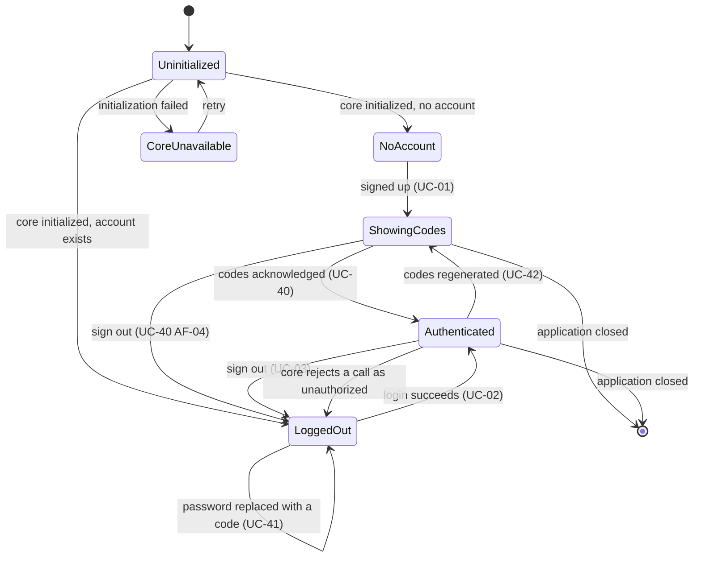
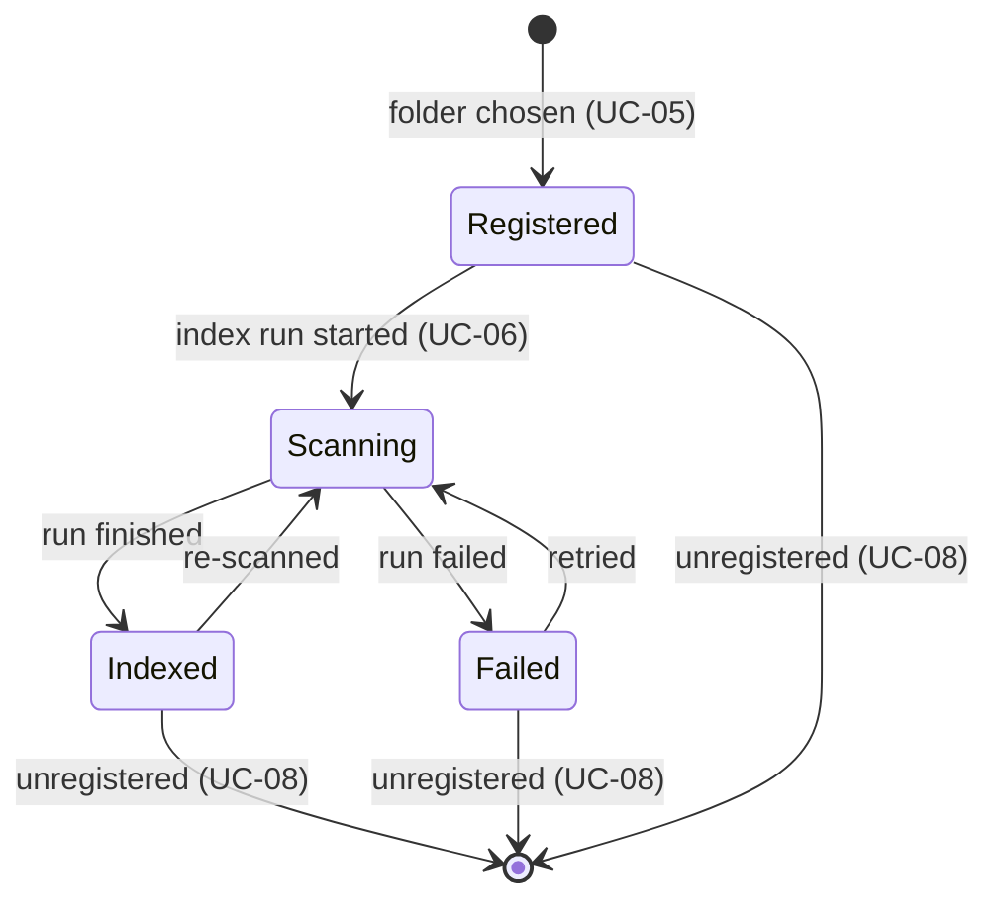
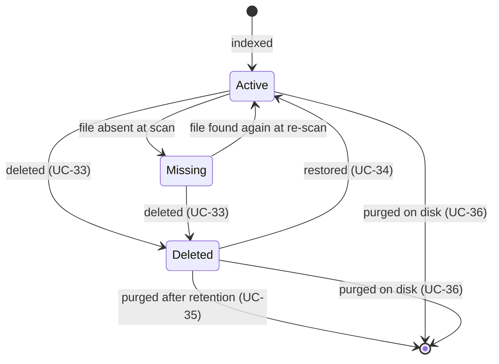
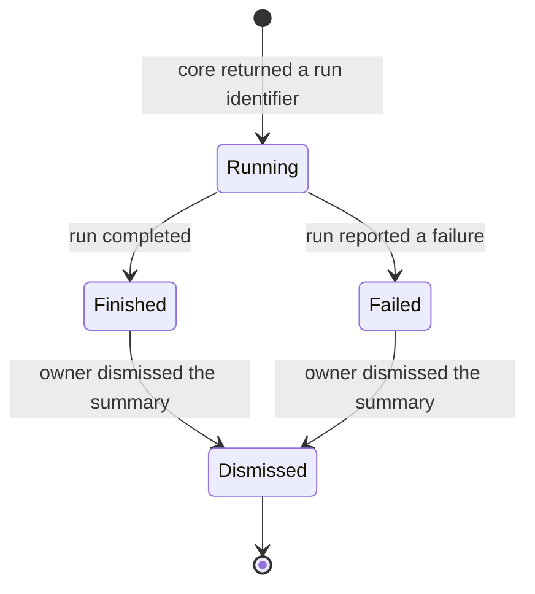
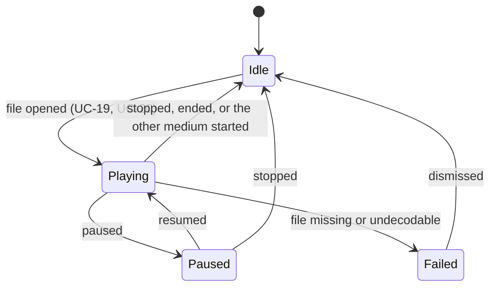
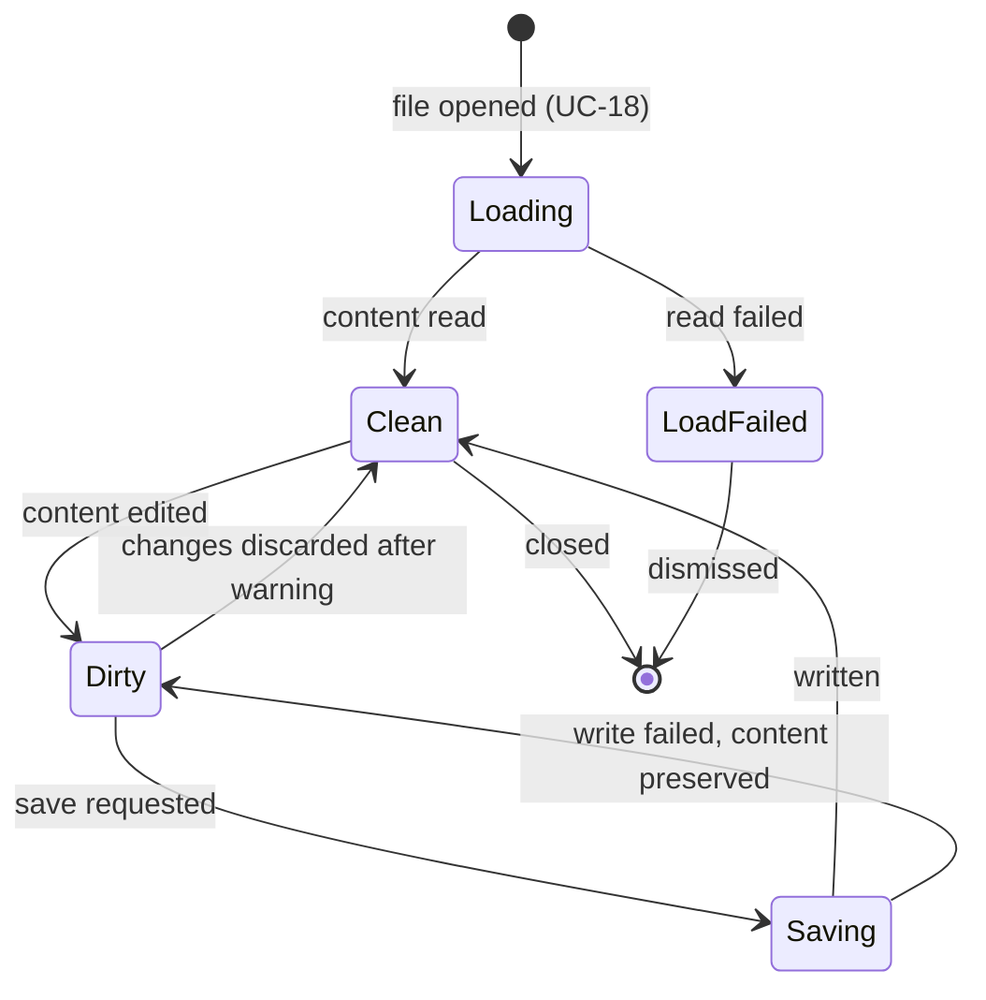

# Use Case Specification Document — Alexandria UI

## 1. Introduction

### 1.1 Purpose

This document specifies the use cases for **Alexandria UI**. Each use case
describes actor interactions, preconditions, postconditions, main flows, and
alternative/exception flows.

Every identifier appearing in a flow is the **public UUID** the Alexandria core
returns, per
[System Requirements §4.0](System%20Requirements%20Document.md). The core's
internal keys never cross the FFI boundary and never appear here.

Three conditions recur in almost every use case and are stated once here rather
than repeated as an alternative flow in each:

- **No active session.** Any use case whose precondition includes an active
  session is unreachable without one; the application presents the login screen
  and issues no call (`FR-AU-07`). Where the *core* rejects a call as
  unauthorized mid-session, that is specified per use case, because it returns
  the owner to login and loses their place.
- **Recovery codes not yet acknowledged.** A newly created account shows its ten
  recovery codes in place of the catalog until the owner confirms having stored
  them (`FR-AU-12`); UC-40 is that step. It is the only thing between signing up
  and the library, and it happens once.
- **The core is unavailable.** A failure to reach or initialize the core is
  presented as a readable message with a retry rather than terminating the
  application (`NFR-14`).
- **Every failure is readable.** No flow below ever ends in a raw status code or
  a silent no-operation (`FR-UX-09`).

### 1.2 Actors

| Actor | Description |
| --- | --- |
| **Owner** | The single human user, and the only actor with access to any catalog operation. Interacts with every use case below. |
| **Alexandria core** | The Rust library linked in process over FFI. Owns the catalog, the database, and every domain rule. Every catalog change in these flows is performed by it, never by the application. |
| **Local filesystem** | The disk holding the library folders. Read directly for media and document bytes; written only by the core, except for the application's own settings and log. |
| **Default browser** | The platform's configured web browser. Involved only when a bookmark is opened. |

### 1.3 Use Case Overview

```mermaid
graph LR
    subgraph Actors
        OWNER(("Owner"))
    end

    subgraph "Authentication (AU)"
        UC01[UC-01: Sign up]
        UC02[UC-02: Log in]
        UC03[UC-03: Sign out]
        UC04[UC-04: Change credentials]
        UC40[UC-40: Save the recovery codes]
        UC41[UC-41: Recover with a code]
        UC42[UC-42: Regenerate the codes]
    end

    subgraph "Library sources (LB)"
        UC05[UC-05: Register a library folder]
        UC06[UC-06: Index a library folder]
        UC07[UC-07: Refresh the catalog]
        UC08[UC-08: Unregister a library folder]
    end

    subgraph "Catalog (CT)"
        UC09[UC-09: Browse by type]
        UC10[UC-10: Switch the view layout]
        UC11[UC-11: Search the catalog]
        UC12[UC-12: Filter and sort]
        UC13[UC-13: View file details]
        UC14[UC-14: View the dashboard]
    end

    subgraph "Editing (ME)"
        UC15[UC-15: Edit music metadata]
        UC16[UC-16: Edit video metadata]
        UC17[UC-17: Rename a file]
        UC18[UC-18: Edit a text file]
    end

    subgraph "Playback (PL)"
        UC19[UC-19: Play a video]
        UC20[UC-20: Play audio]
        UC21[UC-21: See what is playing]
    end

    subgraph "Viewing (VW)"
        UC22[UC-22: View a document]
        UC23[UC-23: Read a comic book]
        UC24[UC-24: View an image]
        UC25[UC-25: View a page]
    end

    subgraph "Organization (OG)"
        UC26[UC-26: Manage collections]
        UC27[UC-27: Organize items]
        UC28[UC-28: Manage bookmarks]
    end

    subgraph "Tracking (TR)"
        UC29[UC-29: Manage watchlists]
        UC30[UC-30: Track watch progress]
        UC31[UC-31: Manage reading lists]
        UC32[UC-32: Track reading progress]
        UC47[UC-47: Manage a playlist]
        UC48[UC-48: Play a playlist]
    end

    subgraph "Lifecycle (LC)"
        UC33[UC-33: Delete an item]
        UC34[UC-34: Restore an item]
        UC35[UC-35: Purge a record]
        UC36[UC-36: Purge on disk]
        UC37[UC-37: Review missing files]
    end

    subgraph "Shell (UX)"
        UC38[UC-38: Navigate the shell]
        UC39[UC-39: Manage preferences]
    end

    OWNER --> UC01
    OWNER --> UC05
    OWNER --> UC09
    OWNER --> UC15
    OWNER --> UC19
    OWNER --> UC22
    OWNER --> UC26
    OWNER --> UC29
    OWNER --> UC33
    OWNER --> UC38
```

---

## 2. Use Case Specifications

---

### UC-01: Sign up

| Field | Value |
| --- | --- |
| **ID** | UC-01 |
| **Name** | Sign up |
| **Actors** | Owner, Alexandria core |
| **Description** | On first launch, the owner creates the single account — the e-mail and password that will gate the library from then on. |
| **Preconditions** | The core is initialized. No account exists yet. |
| **Postconditions** | The core holds a salted password hash and ten single-use recovery codes for the new account. The owner is authenticated, and the codes are shown once before the library opens (UC-40). |
| **Requirements** | FR-AU-01, FR-AU-02, FR-AU-03, FR-AU-11 |

**Main Flow**

1. The application determines at launch that no account exists.
2. The application presents the sign-up screen.
3. The owner enters an e-mail address and a password, and repeats the password.
4. The application validates the e-mail format, that the password is not empty,
   and that the two entries match.
5. The application creates the account through the core.
6. The core stores the salted hash, mints ten single-use recovery codes, and
   returns them with the new session.
7. The application discards the plaintext password, establishes the session, and
   presents the recovery codes (UC-40) rather than the catalog.

**Alternative Flows**

| ID | Condition | Outcome |
| --- | --- | --- |
| AF-01 | The e-mail is malformed or the password is empty | The application marks the field, explains what is wrong, and does not call the core. |
| AF-02 | The two password entries differ | The application marks the confirmation field and does not call the core. |
| AF-03 | The core rejects the credentials as invalid | The application presents the core's reason and keeps the owner on the screen with the password fields cleared. |
| AF-04 | An account already exists | The application presents the login screen instead; changing the credentials is UC-04, and recovering them is UC-41. |
| AF-05 | The core reports a configuration failure | The application explains that the account cannot be created, offers a retry, and remains on the screen. |
| AF-06 | The account is created but the core returns no recovery codes | The account exists and the session is established; the application says so and offers to generate a set (UC-42), rather than showing an empty list (UC-40 AF-03). |

---

### UC-02: Log in

| Field | Value |
| --- | --- |
| **ID** | UC-02 |
| **Name** | Log in |
| **Actors** | Owner, Alexandria core |
| **Description** | The owner authenticates so that the catalog becomes reachable. |
| **Preconditions** | The core is initialized. An account exists. No active session. |
| **Postconditions** | A session credential is held in memory and presented on every subsequent call. The catalog is reachable. |
| **Requirements** | FR-AU-04, FR-AU-05, FR-AU-06, FR-AU-07, FR-AU-08, FR-AU-11 |

**Main Flow**

1. The application presents the login screen and issues no catalog call.
2. The owner enters the e-mail and password.
3. The application validates the e-mail format and that the password is not empty.
4. The application calls the core's local-login operation.
5. The core verifies the credentials and returns the session material.
6. The application holds the session in memory and discards the plaintext
   password.
7. The application opens the home dashboard.

**Alternative Flows**

| ID | Condition | Outcome |
| --- | --- | --- |
| AF-01 | The e-mail is malformed or the password is empty | The application marks the field and does not call the core. The mark, and any refusal above the form, clear at the first keystroke: what they named stops being true as soon as the owner acts on it, and the next attempt restates whatever still is. |
| AF-02 | The core rejects the credentials | The application presents an authentication-failed message, clears the password, and stays on the login screen. The message does not distinguish an unknown address from a wrong password. |
| AF-03 | No account exists in the core | The application presents sign-up instead (UC-01). |
| AF-04 | The core rejects a later call as unauthorized | The application discards the session, returns to the login screen, and states why the owner was signed out. |
| AF-05 | The core is not initialized | The application presents the core-unavailable message with a retry. |
| AF-06 | The owner cannot remember the password | The login screen offers recovery with a recovery code (UC-41). |

---

### UC-03: Sign out

| Field | Value |
| --- | --- |
| **ID** | UC-03 |
| **Name** | Sign out |
| **Actors** | Owner |
| **Description** | The owner ends the session, locking the library without closing the application. |
| **Preconditions** | An active session exists. |
| **Postconditions** | The session credential is discarded, playback has stopped, and the login screen is shown. |
| **Requirements** | FR-AU-09 |

**Main Flow**

1. The owner chooses to sign out.
2. The application stops any active playback.
3. The application discards the session credential and every in-memory catalog
   projection.
4. The application presents the login screen.

**Alternative Flows**

| ID | Condition | Outcome |
| --- | --- | --- |
| AF-01 | An editor holds unsaved changes | The application warns before signing out and lets the owner cancel or save first. |
| AF-02 | An index run is in flight | The application signs out and states that the run continues in the core; its outcome is shown after the next login. |

---

### UC-04: Change credentials

| Field | Value |
| --- | --- |
| **ID** | UC-04 |
| **Name** | Change credentials |
| **Actors** | Owner, Alexandria core |
| **Description** | The owner replaces the stored e-mail and password. |
| **Preconditions** | An active session exists. Credentials already exist in the core. |
| **Postconditions** | The core holds the new salted hash. The existing session remains valid. |
| **Requirements** | FR-AU-10, FR-AU-11 |

**Main Flow**

1. The owner opens preferences and chooses to change the credentials.
2. The owner enters the new e-mail and the new password, and repeats the password.
3. The application validates the format, non-emptiness, and that the entries match.
4. The application calls the core's set-credentials operation with the active
   session.
5. The core stores the new salted hash and confirms.
6. The application discards the plaintext and confirms the change.

**Alternative Flows**

| ID | Condition | Outcome |
| --- | --- | --- |
| AF-01 | Validation fails locally | The application marks the field and does not call the core. |
| AF-02 | The core rejects the call as unauthorized | The application discards the session and returns to login, stating why. |
| AF-03 | The core rejects the new credentials | The application presents the core's reason and leaves the stored credentials unchanged. |

---

### UC-05: Register a library folder

| Field | Value |
| --- | --- |
| **ID** | UC-05 |
| **Name** | Register a library folder |
| **Actors** | Owner, Local filesystem |
| **Description** | The owner adds a folder on disk as a source of files to index, says which kinds of file it holds, and says whether it is a library. Several may be registered. |
| **Preconditions** | An active session exists. |
| **Postconditions** | The folder is recorded locally, with the file types an index of it records and any library it was marked as, and offered for indexing. |
| **Requirements** | FR-LB-01, FR-LB-02, FR-LB-03, FR-LB-04, FR-LB-11, FR-LB-22 |

**Main Flow**

1. The application presents the library-sources screen; when nothing is
   registered, it presents first-run guidance to add a folder.
2. The owner opens the platform's native folder picker and chooses a folder.
3. The application checks that the folder exists, is readable, and is not already
   registered.
4. The application asks which file types an index of the folder records, offering
   every supported type as the default, and — in the same question — whether the
   folder is a library and what to call it. Not a library is the default.
5. The application records the folder locally, with the folder name as its default
   label and the chosen types as its scope; choosing every type is recorded as no
   scope at all, which means every type. A folder marked as a library is recorded
   as one only after the core has accepted it (FR-LB-22), so a folder the
   application shows as a library is one whose files really are out of the type
   panels.
6. The application lists it among the registered folders, showing what it covers,
   and offers to index it (UC-06). Every later index of that folder uses the same
   scope without asking again.

**Alternative Flows**

| ID | Condition | Outcome |
| --- | --- | --- |
| AF-01 | The owner cancels the picker | Nothing is registered and the screen is unchanged. |
| AF-02 | The folder does not exist or cannot be read | The application states which condition failed and registers nothing. |
| AF-03 | The folder is already registered | The application says so and highlights the existing entry. |
| AF-04 | The chosen folder contains, or sits inside, an already-registered folder | The application warns that files will be indexed once per overlapping source and lets the owner confirm or cancel. The scope is asked after the warning is accepted. |
| AF-05 | The owner cancels the file-type question | Nothing is registered. A folder recorded with a scope nobody chose is not what was asked for, so the registration is abandoned rather than completed with a default. |
| AF-06 | The folder is marked as a library but left unnamed | The answer cannot be given: a library is addressed by its name, and marked-but-unnamed is not a state the application can record. |
| AF-07 | The core refuses the library — the folder sits inside one it already holds | The folder is registered as an ordinary source folder and is indexable; only the marking did not happen. The owner asked for two things and gets the one that was available, and the folder's row offers the marking again. |

> **The library question is asked with the scope, not after it.** "Which types"
> and "is this a library" are one question — what is this folder — and asking
> them in two modal steps would make registering a course two decisions where
> the owner made one.
>
> **A folder registered before this question existed is not stranded.** Its row
> offers to mark it, which is the same operation reached at a different moment;
> re-registering it to answer would mean un-registering it first (UC-08) and
> starting over.

---

### UC-06: Index a library folder

| Field | Value |
| --- | --- |
| **ID** | UC-06 |
| **Name** | Index a library folder |
| **Actors** | Owner, Alexandria core, Local filesystem |
| **Description** | The owner starts a scan of a registered folder and watches it complete without the interface locking up. |
| **Preconditions** | An active session exists. At least one library folder is registered. |
| **Postconditions** | The catalog contains the folder's files. The run's outcome is recorded against the folder. |
| **Requirements** | FR-LB-05, FR-LB-07, FR-LB-08, FR-LB-09 |

**Main Flow**

1. The owner starts an index run for a registered folder.
2. The application calls the core to start the scan and retains the run identifier
   it returns.
3. The application presents the run as in progress and leaves browsing, playback,
   viewing, and editing available.
4. The application observes the run's progress off the interface thread.
5. The run finishes; the application presents the outcome — files added, files
   updated, files found missing — and keeps it visible until dismissed.
6. The application refreshes the type counts and any open listing.

**Alternative Flows**

| ID | Condition | Outcome |
| --- | --- | --- |
| AF-01 | A run for that folder is already in flight | The application refuses to start a second one and points at the running one. |
| AF-02 | The core rejects the start as invalid input | The application presents the reason and marks the folder as not scanned. |
| AF-03 | The folder disappeared or became unreadable since registration | The application presents the failure and offers to unregister the folder (UC-08). |
| AF-04 | The run reports files missing on disk | The outcome links to the missing-files review (UC-37). |
| AF-08 | The run reports files it could not record | The outcome says so in the screen's warning colours rather than as a clause on the summary line: those files are on disk and absent from the library, and no other screen will ever mention them. It happens under write contention, where a file's insert exhausts the core's retry bound — the core counts it and carries on rather than abandoning the walk. The outcome also offers to name them (FR-LB-23), because a count alone leaves the owner nowhere to look, and the remedy is another run, which the folder's row already offers beside the report. |
| AF-05 | The application is closed while a run is in flight | The run belongs to the core; its outcome is presented at the next launch. |
| AF-06 | The core rejects the call as unauthorized | The session is discarded and the owner returns to login. |
| AF-07 | The folder's recorded file types name nothing this version recognizes, or no registered folder answers the path | The application refuses the run before calling the core, and says which. Neither can be read as a scope, and no scope means every type — so running one would index what the owner narrowed the folder to exclude. |

---

### UC-07: Refresh the catalog

| Field | Value |
| --- | --- |
| **ID** | UC-07 |
| **Name** | Refresh the catalog |
| **Actors** | Owner, Alexandria core, Local filesystem |
| **Description** | Everything already cataloged is re-checked, across every registered folder at once — either because the owner asked for it, or once, unannounced, when a session is established (FR-LB-21). |
| **Preconditions** | An active session exists. The catalog is not empty. |
| **Postconditions** | Every cataloged record is refreshed; changed files are updated and absent files are marked missing. |
| **Requirements** | FR-LB-06, FR-LB-07, FR-LB-08, FR-LB-21 |

**Main Flow**

1. The owner starts a refresh, or a session is established with the
   re-check preference on (FR-LB-21).
2. The application calls the core's refresh operation and retains the run
   identifier.
3. The application presents the run as in progress, without blocking the interface.
4. The run finishes; the application presents what was updated and what is now
   missing, and keeps it visible until dismissed.
5. The application refreshes the type counts and any open listing.

**Alternative Flows**

| ID | Condition | Outcome |
| --- | --- | --- |
| AF-01 | A refresh is already in flight | Owner-started: the application points at the running one rather than starting a second. Started at sign-in: the check is silently not repeated — nothing is presented, because nobody asked (FR-LB-21). |
| AF-02 | The catalog is empty | Owner-started: the application offers to register and index a folder instead (UC-05, UC-06). Started at sign-in: nothing is presented; the offer is what the owner already sees on an empty catalog regardless. |
| AF-03 | The refresh marks files missing | The outcome links to the missing-files review (UC-37). |
| AF-04 | The core rejects the call as unauthorized | The session is discarded and the owner returns to login, whether the refresh was owner-started or begun at sign-in. |
| AF-05 | The owner has turned the sign-in re-check off, or a run the core already had outstanding covers it (FR-LB-19) | Started at sign-in only: no refresh is started, and nothing is presented. |

---

### UC-08: Unregister a library folder

| Field | Value |
| --- | --- |
| **ID** | UC-08 |
| **Name** | Unregister a library folder |
| **Actors** | Owner |
| **Description** | The owner stops treating a folder as a library source, without losing catalog records or files. |
| **Preconditions** | An active session exists. The folder is registered. |
| **Postconditions** | The folder is no longer listed as a source. Catalog records and on-disk files are untouched. |
| **Requirements** | FR-LB-10 |

**Main Flow**

1. The owner chooses to unregister a folder.
2. The application presents a confirmation stating that catalog records and
   on-disk files are left untouched and only the source registration is removed.
3. The owner confirms.
4. The application removes the folder from the registered sources and updates the
   screen.

**Alternative Flows**

| ID | Condition | Outcome |
| --- | --- | --- |
| AF-01 | The owner cancels | Nothing changes. |
| AF-02 | A run for that folder is in flight | The application refuses until the run settles, and says so. |
| AF-03 | It is the last registered folder | The application unregisters it and presents the first-run guidance again; the catalog is untouched. |

---

### UC-09: Browse the library by type

| Field | Value |
| --- | --- |
| **ID** | UC-09 |
| **Name** | Browse the library by type |
| **Actors** | Owner, Alexandria core |
| **Description** | The owner selects a file type in the navigation panel and sees the matching items, merged across every registered folder. |
| **Preconditions** | An active session exists. |
| **Postconditions** | The listing shows the items of the selected type. |
| **Requirements** | FR-CT-01, FR-CT-02, FR-CT-10, FR-LB-04 |

**Main Flow**

1. The application presents the navigation panel listing every file type with its
   item count.
2. The owner selects a type.
3. The application requests that type's items from the core, filtered to active
   records.
4. The core returns the matching records.
5. The application renders the listing, materializing only the rows on screen.

**Alternative Flows**

| ID | Condition | Outcome |
| --- | --- | --- |
| AF-01 | The type has no items | The application presents an empty state distinct from loading and from error, offering to index a folder when the catalog is empty. |
| AF-02 | The core returns a failure | The application presents a readable message with a retry, and leaves the previous listing intact. |
| AF-03 | The listing is large | Rows are materialized as they scroll into view; the scroll cost does not grow with the library size. |
| AF-04 | The core rejects the call as unauthorized | The session is discarded and the owner returns to login. |

---

### UC-10: Switch the view layout

| Field | Value |
| --- | --- |
| **ID** | UC-10 |
| **Name** | Switch the view layout |
| **Actors** | Owner |
| **Description** | The owner chooses between list, list with details, and grid, and the choice sticks per type. |
| **Preconditions** | An active session exists and a listing is open. |
| **Postconditions** | The listing is rendered in the chosen layout, and the choice is remembered for that type. |
| **Requirements** | FR-CT-03, FR-CT-04 |

**Main Flow**

1. The owner selects one of the three layouts.
2. The application re-renders the current listing in that layout, keeping the
   scroll position on the same item where possible.
3. The application records the choice for that file type in the local settings.
4. Returning to that type later restores the same layout.

**Alternative Flows**

| ID | Condition | Outcome |
| --- | --- | --- |
| AF-01 | The window is too narrow for the chosen layout | The application renders the closest layout that fits and indicates the substitution rather than clipping columns. |
| AF-02 | The settings store cannot be written | The layout still changes for the session, and the application reports that the preference was not saved. |

---

### UC-11: Search the catalog

| Field | Value |
| --- | --- |
| **ID** | UC-11 |
| **Name** | Search the catalog |
| **Actors** | Owner, Alexandria core |
| **Description** | The owner finds items by name or metadata across every type at once. |
| **Preconditions** | An active session exists. |
| **Postconditions** | Matching items are listed, grouped by type. |
| **Requirements** | FR-CT-06, FR-CT-09 |

**Main Flow**

1. The owner enters a search term.
2. The application matches it against file names and the type-specific metadata
   the core exposes for the loaded catalog.
3. The application presents the matches grouped by type, with the matched term
   highlighted.
4. The owner opens a result, which behaves exactly as opening it from its listing
   (UC-13).

**Alternative Flows**

| ID | Condition | Outcome |
| --- | --- | --- |
| AF-01 | Nothing matches | The application presents an empty-result state naming the term, distinct from loading and error. |
| AF-02 | The term is blank or whitespace | The application clears the search and restores the previous listing. |
| AF-03 | The catalog is still loading | The application searches what has loaded and indicates that results may grow as loading completes. |
| AF-04 | The catalog is empty | The application offers to register and index a folder instead. |

> **Bookmarks are not searched.** `FR-CT-06` matches file names and the
> type-specific metadata the core exposes for files; a bookmark is neither a
> file nor carries that metadata. The search field is therefore not offered on
> the bookmarks area (UC-28), where it could only have replaced the bookmarks
> with matching files. Bookmarks are narrowed by their own collection filter
> instead. Searching them is a change to `FR-CT-06`, not to this flow.

---

### UC-12: Filter and sort a listing

| Field | Value |
| --- | --- |
| **ID** | UC-12 |
| **Name** | Filter and sort a listing |
| **Actors** | Owner, Alexandria core |
| **Description** | The owner narrows and orders a listing by type, lifecycle state, containing collection, and type-specific attributes. |
| **Preconditions** | An active session exists and a listing is open. |
| **Postconditions** | The listing shows the filtered, ordered items, and the choices are remembered for that type. |
| **Requirements** | FR-CT-07, FR-CT-08 |

**Main Flow**

1. The owner opens the filter controls and selects one or more filters.
2. The application requests the matching records from the core, passing the
   filters the core supports and applying the remainder to the returned set.
3. The owner chooses a sort field and direction.
4. The application orders and re-renders the listing.
5. The application records the filters and sort for that type in the local
   settings.

**Alternative Flows**

| ID | Condition | Outcome |
| --- | --- | --- |
| AF-01 | The filter combination matches nothing | The application presents an empty-result state naming the active filters and offering to clear them. |
| AF-02 | The owner clears the filters | The application restores the unfiltered listing and clears the stored filters for that type. |
| AF-03 | A filter names a collection that no longer exists | The application drops that filter, says so, and re-runs the query. |
| AF-04 | The core rejects the filter as invalid input | The application presents the reason and reverts to the previous filters. |

---

### UC-13: View a file's details

| Field | Value |
| --- | --- |
| **ID** | UC-13 |
| **Name** | View a file's details |
| **Actors** | Owner, Alexandria core |
| **Description** | The owner inspects one file's metadata, path, and state, and reaches every action available for it. |
| **Preconditions** | An active session exists and the file is in the catalog. |
| **Postconditions** | The file's current details are shown. |
| **Requirements** | FR-CT-05, FR-CT-12 |

**Main Flow**

1. The owner presses the details button on a file's row or tile, in a listing,
   the dashboard's recent list, or a library's folder view. Tapping the row
   itself opens the file rather than its details: a reader, a viewer, or
   playback, according to its type. The details are one press away from
   wherever a file is listed, because everything else a file can have done to
   it — renaming, metadata, collections, deletion — is reached from them.
2. The application requests the file by its UUID from the core.
3. The core returns the record with its type-specific metadata.
4. The application presents the metadata, the on-disk path, and the lifecycle
   state, together with the actions the file's type allows.
5. The owner may open the file from here too, which hands off to the same
   viewer or player a tap on the row would — the details remain the way in for
   a file that cannot simply be opened.

**Alternative Flows**

| ID | Condition | Outcome |
| --- | --- | --- |
| AF-01 | The core reports the file as not found | The application says the file is no longer in the catalog and returns to the listing, refreshing it. |
| AF-02 | The record is soft-deleted | The application shows it as deleted and offers restore (UC-34) instead of editing. |
| AF-03 | The record is marked missing on disk | The application shows it as missing, offers a re-scan, and disables the actions that need the file. A tap on such a file's row opens these details rather than a reader, since there is nothing on disk to open. |
| AF-04 | No viewer is registered for the type | The application presents the details and reports that the file cannot be opened, leaving the other actions available. |
| AF-05 | The core rejects the call as unauthorized | The session is discarded and the owner returns to login. |

---

### UC-14: View the home dashboard

| Field | Value |
| --- | --- |
| **ID** | UC-14 |
| **Name** | View the home dashboard |
| **Actors** | Owner, Alexandria core |
| **Description** | The owner opens the application and sees the state of the library at a glance. |
| **Preconditions** | An active session exists. |
| **Postconditions** | The dashboard shows recent items, items in progress, per-type counts, and the last run's outcome. |
| **Requirements** | FR-CT-11 |

**Main Flow**

1. The application opens the dashboard after login.
2. The application requests recently added files, watchlist and reading-list
   items in progress, and per-type counts from the core.
3. The application presents them alongside the outcome of the most recent index
   run.
4. The owner opens any item, which behaves as opening it from its listing.

**Alternative Flows**

| ID | Condition | Outcome |
| --- | --- | --- |
| AF-01 | The catalog is empty | The dashboard presents the first-run guidance to register and index a folder (UC-05). |
| AF-02 | No item is in progress | That section states so rather than rendering empty. |
| AF-03 | A section's query fails | That section shows its own failure and retry; the rest of the dashboard still renders. |
| AF-04 | A run is in flight | The dashboard shows it as running and updates when it settles. |

---

### UC-15: Edit music metadata

| Field | Value |
| --- | --- |
| **ID** | UC-15 |
| **Name** | Edit music metadata |
| **Actors** | Owner, Alexandria core |
| **Description** | The owner corrects an audio file's title, artist, album, year, genre, track, and the rest of its music metadata. |
| **Preconditions** | An active session exists. The file is an active audio record. |
| **Postconditions** | The core holds the edited metadata and every open view reflects it. |
| **Requirements** | FR-ME-01, FR-ME-03, FR-ME-05 |

**Main Flow**

1. The owner opens the metadata form from an audio file's detail view.
2. The application presents the current values.
3. The owner edits one or more fields.
4. The application validates the edited fields locally.
5. The application sends the change to the core.
6. The core validates, persists, and returns the updated metadata.
7. The application updates the detail view and every open listing without a manual
   refresh.

**Alternative Flows**

| ID | Condition | Outcome |
| --- | --- | --- |
| AF-01 | Local validation fails | The application marks the field and does not call the core. |
| AF-02 | The core rejects the change as invalid | The application presents the core's reason as final, keeps the form open, and leaves the stored metadata unchanged. |
| AF-03 | The core reports the file as not found | The application says the file is no longer in the catalog and closes the form. |
| AF-04 | Nothing was actually changed | The application closes the form without calling the core. |
| AF-05 | The core rejects the call as unauthorized | The session is discarded and the owner returns to login. |

---

### UC-16: Edit video metadata

| Field | Value |
| --- | --- |
| **ID** | UC-16 |
| **Name** | Edit video metadata |
| **Actors** | Owner, Alexandria core |
| **Description** | The owner corrects a video file's metadata, including whether it is a movie or a series. |
| **Preconditions** | An active session exists. The file is an active video record. |
| **Postconditions** | The core holds the edited metadata and every open view reflects it. |
| **Requirements** | FR-ME-02, FR-ME-03, FR-ME-05 |

**Main Flow**

1. The owner opens the metadata form from a video file's detail view.
2. The application presents the current values, including the movie-or-series
   marking.
3. The owner edits one or more fields.
4. The application validates locally and sends the change to the core.
5. The core validates, persists, and returns the updated metadata.
6. The application updates the detail view and every open listing.

**Alternative Flows**

| ID | Condition | Outcome |
| --- | --- | --- |
| AF-01 | Local validation fails | The application marks the field and does not call the core. |
| AF-02 | The core rejects the change | The application presents the reason and leaves the stored metadata unchanged. |
| AF-03 | The marking changes from series to movie while watch progress records episodes | The application warns that per-episode progress becomes single-item progress and asks for confirmation before calling the core. |
| AF-04 | The core reports the file as not found | The application says so and closes the form. |
| AF-05 | The core rejects the call as unauthorized | The session is discarded and the owner returns to login. |

---

### UC-17: Rename a file

| Field | Value |
| --- | --- |
| **ID** | UC-17 |
| **Name** | Rename a file |
| **Actors** | Owner, Alexandria core, Local filesystem |
| **Description** | The owner renames a file, which the core applies to the catalog and to the file on disk. |
| **Preconditions** | An active session exists. The file is an active record. |
| **Postconditions** | The file carries the new name in the catalog and on disk. |
| **Requirements** | FR-ME-04, FR-ME-05 |

**Main Flow**

1. The owner chooses to rename a file and enters the new name.
2. The application rejects names containing characters the host operating system
   forbids, and empty names, before calling.
3. The application sends the rename to the core.
4. The core renames the file on disk and updates the record.
5. The application reflects the new name in the detail view and every open
   listing.

**Alternative Flows**

| ID | Condition | Outcome |
| --- | --- | --- |
| AF-01 | The name is empty or contains forbidden characters | The application marks the field and does not call the core. |
| AF-02 | The core reports a disk failure | The application presents the failure and states that neither the catalog nor the file changed. |
| AF-03 | The core reports the file as not found | The application says the file is no longer in the catalog and refreshes the listing. |
| AF-04 | The new name equals the current one | The application closes the dialog without calling the core. |
| AF-05 | The core rejects the call as unauthorized | The session is discarded and the owner returns to login. |

---

### UC-18: Edit a Markdown or text file

| Field | Value |
| --- | --- |
| **ID** | UC-18 |
| **Name** | Edit a Markdown or text file |
| **Actors** | Owner, Alexandria core, Local filesystem |
| **Description** | The owner edits a note or text file, with a live preview, and saves the content back to disk. |
| **Preconditions** | An active session exists. The file is an active text record. |
| **Postconditions** | The file on disk holds the edited content and the core has refreshed its content hash. |
| **Requirements** | FR-ME-06, FR-ME-07, FR-ME-08, FR-ME-09, FR-ME-10 |

**Main Flow**

1. The owner opens a text or Markdown file for editing.
2. The application reads the content through the core.
3. The application presents the source alongside a live rendered preview.
4. The owner edits the content; the preview follows as they type.
5. The owner saves.
6. The application compares the content to what was loaded and, if it differs,
   sends it to the core.
7. The core writes the file and refreshes the record; the application marks the
   editor as saved.

**Alternative Flows**

| ID | Condition | Outcome |
| --- | --- | --- |
| AF-01 | The content is unchanged | The application skips the call and reports that there is nothing to save. |
| AF-02 | The owner leaves with unsaved changes | The application warns and offers to save, discard, or cancel. |
| AF-03 | The core reports a disk failure on write | The application presents the failure and leaves the editor content exactly as it was, unsaved. |
| AF-04 | The core reports the file as not found | The application reports that the file is no longer in the catalog and keeps the edited content on screen until the owner dismisses it, so nothing typed is lost silently. |
| AF-05 | The file changed on disk since it was loaded | The application warns before overwriting and lets the owner reload or continue. |
| AF-06 | The core rejects the call as unauthorized | The session is discarded and the owner returns to login; unsaved content is warned about first. |

---

### UC-19: Play a video

| Field | Value |
| --- | --- |
| **ID** | UC-19 |
| **Name** | Play a video |
| **Actors** | Owner, Local filesystem |
| **Description** | The owner watches a movie or an episode, with full-screen, seeking, subtitles, and audio-track selection. |
| **Preconditions** | An active session exists. The file is an active video record whose file is present on disk. |
| **Postconditions** | Playback ran; a resume position is recorded. |
| **Requirements** | FR-PL-01, FR-PL-02, FR-PL-03, FR-PL-04, FR-PL-08, FR-PL-10 |

**Main Flow**

1. The owner opens a video file.
2. The application stops any active audio playback.
3. The application opens the file from its on-disk path in the video player,
   without transcoding.
4. The player offers pause and resume, seeking forward and backward, and
   full-screen toggling.
5. The owner selects a subtitle track, or turns subtitles off, from those the file
   provides.
6. The owner selects an audio track from those the file provides.
7. Playback stops or ends; the application records the resume position.

**Alternative Flows**

| ID | Condition | Outcome |
| --- | --- | --- |
| AF-01 | The file is absent from disk | The application reports it as missing, offers a re-scan, and does not start playback. |
| AF-02 | The file cannot be decoded | The application reports that the format cannot be played and returns to the detail view, without terminating. |
| AF-03 | The file carries no subtitle or no alternative audio track | Those controls state that none is available rather than being silently absent. |
| AF-04 | A resume position exists | The application offers to resume or start over before playing. |
| AF-05 | The owner starts audio playback while the video plays | Video playback stops first (`FR-PL-08`). |

---

### UC-20: Play audio

| Field | Value |
| --- | --- |
| **ID** | UC-20 |
| **Name** | Play audio |
| **Actors** | Owner, Local filesystem |
| **Description** | The owner listens to a track, an album, or an artist, in a player that stays available while they browse. |
| **Preconditions** | An active session exists. The files are active audio records present on disk. |
| **Postconditions** | Playback ran; a resume position is recorded for the last played track. |
| **Requirements** | FR-PL-05, FR-PL-06, FR-PL-08, FR-PL-09, FR-PL-10 |

**Main Flow**

1. The owner plays a track, an album, or an artist.
2. The application stops any active video playback.
3. The application builds the playback queue — one track, an album's tracks in
   order, or an artist's tracks.
4. The application plays from the on-disk path in the persistent player bar.
5. The owner navigates elsewhere in the application; playback and the player bar
   continue.
6. The owner pauses, resumes, and skips within the queue.
7. Playback stops or the queue ends; the application records the resume position.

**Alternative Flows**

| ID | Condition | Outcome |
| --- | --- | --- |
| AF-01 | A queued file is absent from disk | The application skips it, reports which file was skipped, and continues the queue. |
| AF-02 | A queued file cannot be decoded | The application skips it with a readable report and continues. |
| AF-03 | Every queued file fails | The application stops, reports that nothing in the selection could be played, and clears the queue. |
| AF-04 | A resume position exists for a single track | The application offers to resume or start over. |
| AF-05 | The owner starts video playback | Audio playback stops first (`FR-PL-08`). |

---

### UC-21: See what is playing

| Field | Value |
| --- | --- |
| **ID** | UC-21 |
| **Name** | See what is playing |
| **Actors** | Owner |
| **Description** | While audio plays, a full-window player shows the album's own picture, names the track and the record it is from, and shows the sound moving — bars that run while playback runs and settle when it stops. |
| **Preconditions** | Audio playback is active (UC-20). |
| **Postconditions** | The catalog is unchanged; playback is unaffected by opening or closing the player. |
| **Requirements** | FR-PL-07, FR-PL-11, FR-PL-12, FR-PL-13 |

**Main Flow**

1. Audio playback begins — a track, an album, or an artist.
2. The application opens the full-window player, on every track played
   (AF-04 is the owner turning that off). The owner reaches it again from the
   playback bar: from its button, or by pressing the sleeve beside it, which
   is what they recognise.
3. The player shows the album's own picture, the track's name, the artist
   whose record it is, and the album — never the file's name (FR-CT-13).
4. The bars move with the music: they are drawn from the core's own
   measurement of the recording (api FR-MP-07), read at the position playing,
   and they settle when playback is paused or stopped.
5. The owner drags the position indication to move playback within the
   track.
6. The owner operates the transport on the player — back, play and pause,
   stop, forward — which reaches the same queue the playback bar's controls
   reach.
7. The owner closes the player; playback and the bar are untouched.

**Alternative Flows**

| ID | Condition | Outcome |
| --- | --- | --- |
| AF-01 | The file carries no picture of its own | The player and the bar show a placeholder in the sleeve's own shape, rather than an empty frame. |
| AF-02 | The owner navigates to another screen | Playback and the persistent player continue; the full player is reachable again from the bar. |
| AF-03 | The system requests reduced motion | The bars are drawn without moving: the levels of the moment playback is at, and none of the motion somebody asked the system not to show them. |
| AF-06 | The recording has not been measured yet, or cannot be | The bars rest. The first play of a track waits while the core measures it, and a file the core cannot decode is never measured — in both cases the player shows no motion rather than inventing some. |
| AF-04 | The owner has turned off opening the player automatically | Playback starts where the owner left the interface; the player is opened by hand from the bar. |
| AF-05 | The owner asks for the words of the track playing | The application gives one side of the window to them and moves the player over into what is left, rather than covering it. The same control puts them away and gives the whole window back. |

---

### UC-22: View a document

| Field | Value |
| --- | --- |
| **ID** | UC-22 |
| **Name** | View a document |
| **Actors** | Owner, Local filesystem |
| **Description** | The owner reads a PDF or an e-book, with page or chapter navigation and a remembered position. |
| **Preconditions** | An active session exists. The file is an active document record present on disk. |
| **Postconditions** | The document was displayed; the reading position is remembered. |
| **Requirements** | FR-VW-01, FR-VW-02, FR-VW-07, FR-VW-08 |

**Main Flow**

1. The owner opens a document.
2. The application resolves the viewer registered for the file's type.
3. The application reads the file's bytes from its on-disk path.
4. The viewer presents the document with page or chapter navigation.
5. The owner reads and navigates; the position is remembered.
6. The owner closes the viewer; no bytes are retained.

**Alternative Flows**

| ID | Condition | Outcome |
| --- | --- | --- |
| AF-01 | The file is absent from disk | The application reports it as missing and offers a re-scan. |
| AF-02 | The file is corrupt or not the format its extension claims | The viewer reports that the document cannot be read and returns to the detail view. |
| AF-03 | The document is encrypted or password-protected | The viewer reports that it cannot be opened; the application does not prompt for or store a password. |
| AF-04 | No viewer is registered for the type | The application reports it and leaves the file's other actions available. |

---

### UC-23: Read a comic book

| Field | Value |
| --- | --- |
| **ID** | UC-23 |
| **Name** | Read a comic book |
| **Actors** | Owner, Local filesystem |
| **Description** | The owner reads a comic book archive page by page. |
| **Preconditions** | An active session exists. The file is an active comic-book record present on disk. |
| **Postconditions** | The comic was displayed; the page position is remembered. |
| **Requirements** | FR-VW-03, FR-VW-07, FR-VW-08 |

**Main Flow**

1. The owner opens a comic book.
2. The application reads the archive's entries from its on-disk path without
   extracting it.
3. The viewer presents the pages in order, with page navigation and fit controls.
4. The owner reads; the page position is remembered.
5. The owner closes the viewer; nothing is left extracted on disk.

**Alternative Flows**

| ID | Condition | Outcome |
| --- | --- | --- |
| AF-01 | The file is absent from disk | The application reports it as missing and offers a re-scan. |
| AF-02 | The archive is corrupt | The viewer reports that the comic cannot be read and returns to the detail view. |
| AF-03 | The archive format is not supported by the bundled decoder | The viewer reports which format the file is and that it cannot be opened, leaving the file's other actions available. |
| AF-04 | An individual page cannot be decoded | The viewer skips it, marks the gap, and continues with the remaining pages. |

---

### UC-24: View an image

| Field | Value |
| --- | --- |
| **ID** | UC-24 |
| **Name** | View an image |
| **Actors** | Owner, Local filesystem |
| **Description** | The owner views an image, fitted to the window or zoomed. |
| **Preconditions** | An active session exists. The file is an active image record present on disk. |
| **Postconditions** | The image was displayed. |
| **Requirements** | FR-VW-04, FR-VW-07 |

**Main Flow**

1. The owner opens an image.
2. The application reads its bytes from the on-disk path.
3. The viewer presents it fitted to the window.
4. The owner zooms and pans, or returns to fit.
5. The owner moves to the next or previous image in the current listing.

**Alternative Flows**

| ID | Condition | Outcome |
| --- | --- | --- |
| AF-01 | The file is absent from disk | The application reports it as missing and offers a re-scan. |
| AF-02 | The image cannot be decoded | The viewer reports it and offers to move to the next image. |
| AF-03 | The image is very large | The viewer presents a downscaled render first and refines it, rather than blocking the interface. |

---

### UC-25: View a saved page

| Field | Value |
| --- | --- |
| **ID** | UC-25 |
| **Name** | View a saved page |
| **Actors** | Owner, Local filesystem |
| **Description** | The owner reads a saved HTML page, or a Markdown file rendered rather than edited. |
| **Preconditions** | An active session exists. The file is an active HTML or text record present on disk. |
| **Postconditions** | The page was displayed as rendered content. |
| **Requirements** | FR-VW-05, FR-VW-06, FR-VW-07 |

**Main Flow**

1. The owner opens an HTML page, or opens a Markdown file for reading.
2. The application reads the file's bytes from the on-disk path.
3. The viewer renders the content as widgets, executing no script the page
   contains, and renders it as the page was written to look: the rules of the
   stylesheets the page carries are resolved onto the elements they select,
   and its relative references — the pictures saved beside it — resolve
   against the folder it was read from. What the renderer has no answer for is
   left out rather than approximated: rules that depend on something other
   than the document itself (`@media`, `:hover`), and properties it does not
   draw.
4. The owner reads, and may switch a Markdown file into the editor (UC-18).

**Alternative Flows**

| ID | Condition | Outcome |
| --- | --- | --- |
| AF-01 | The file is absent from disk | The application reports it as missing and offers a re-scan. |
| AF-02 | The page references assets that are absent | The page renders without them and indicates what could not be loaded. |
| AF-03 | The page contains script | It is rendered without executing it; the application states that scripts are not run. |
| AF-04 | The markup is malformed | The viewer renders what it can and reports that the page may be incomplete. |
| AF-05 | The page embeds a frame | The frame is presented as a link to where it pointed. A frame would be a browser engine inside a viewer that states it runs no script — and on this application's own platforms there is none to embed. |
| AF-06 | A stylesheet the page names is on the network, or was not saved with it | It is not fetched, and the page is drawn with the styling it does have. A local sheet that is missing is named to the owner as any other missing asset is (AF-02). |

---

### UC-26: Manage collections

| Field | Value |
| --- | --- |
| **ID** | UC-26 |
| **Name** | Manage collections |
| **Actors** | Owner, Alexandria core |
| **Description** | The owner creates, renames, and deletes collections of files or of bookmarks. |
| **Preconditions** | An active session exists. |
| **Postconditions** | The core holds the created, renamed, or deleted collection; contained items are preserved in every case. |
| **Requirements** | FR-OG-01, FR-OG-02, FR-OG-03 |

**Main Flow**

1. The owner opens the collections screen.
2. The owner creates a collection, giving it a name and choosing whether it holds
   files or bookmarks.
3. The application validates the name and sends the creation to the core.
4. The core creates the collection and returns it.
5. The owner renames a collection; the application validates and sends the change.
6. The owner deletes a collection; the application confirms, stating that the
   contained items are preserved and only the grouping is removed, and then calls
   the core.

**Alternative Flows**

| ID | Condition | Outcome |
| --- | --- | --- |
| AF-01 | The name is blank after trimming | The application marks the field and does not call the core. |
| AF-02 | The core rejects the name | The application presents the core's reason and keeps the form open. |
| AF-03 | The owner cancels a deletion | Nothing changes. |
| AF-04 | The core reports the collection as not found | The application says so and refreshes the collections list. |
| AF-05 | The core rejects the call as unauthorized | The session is discarded and the owner returns to login. |

---

### UC-27: Organize items into collections

| Field | Value |
| --- | --- |
| **ID** | UC-27 |
| **Name** | Organize items into collections |
| **Actors** | Owner, Alexandria core |
| **Description** | The owner adds items to a collection, removes them, and browses a collection's members. |
| **Preconditions** | An active session exists and at least one collection exists. |
| **Postconditions** | The collection's membership reflects the change; the items themselves are untouched. |
| **Requirements** | FR-OG-04, FR-OG-05, FR-OG-06, FR-OG-07 |

**Main Flow**

1. The owner opens a collection.
2. The application requests its members from the core and lists them, with
   breadcrumbs reflecting the owner's position in the collection hierarchy.
3. The owner adds one or more items of the collection's kind.
4. The application sends the additions to the core and refreshes the membership.
5. The owner removes an item; the application sends the removal to the core.
6. The item remains in the catalog and disappears only from this collection.

**Alternative Flows**

| ID | Condition | Outcome |
| --- | --- | --- |
| AF-01 | An item's kind does not match the collection's | The application does not offer it, and states why if the owner reaches it another way. |
| AF-02 | An item is already a member | The application reports it as already present and adds nothing. |
| AF-03 | The core reports the collection or the item as not found | The application says so and refreshes the membership. |
| AF-04 | Some of a multiple-item addition fail | The application reports exactly which succeeded and which did not. |
| AF-05 | The core rejects the call as unauthorized | The session is discarded and the owner returns to login. |

---

### UC-28: Manage bookmarks

| Field | Value |
| --- | --- |
| **ID** | UC-28 |
| **Name** | Manage bookmarks |
| **Actors** | Owner, Alexandria core, Default browser |
| **Description** | The owner creates, updates, lists, and opens browser bookmarks, optionally filed in bookmark collections. |
| **Preconditions** | An active session exists. |
| **Postconditions** | The core holds the created or updated bookmark. |
| **Requirements** | FR-OG-08, FR-OG-09, FR-OG-10, FR-OG-11, FR-OG-12 |

**Main Flow**

1. The owner opens the bookmarks screen, optionally filtered to one bookmark
   collection.
2. The application requests the matching bookmarks from the core and lists them.
3. The owner creates a bookmark with a URL, a title, and optionally a collection.
4. The application validates that the URL parses and the title is not blank, then
   sends the creation to the core.
5. The owner updates a bookmark's URL, title, or collection; the application
   validates and sends the change.
6. The owner opens a bookmark; the application hands the URL to the default
   browser.

**Alternative Flows**

| ID | Condition | Outcome |
| --- | --- | --- |
| AF-01 | The URL does not parse, or the title is blank | The application marks the field and does not call the core. |
| AF-02 | The core rejects the bookmark | The application presents the core's reason and keeps the form open. |
| AF-03 | The named collection is not a bookmark collection | The application does not offer it, and states why if reached another way. |
| AF-04 | No default browser can be launched | The application reports it and offers to copy the URL instead. |
| AF-05 | The core reports the bookmark as not found | The application says so and refreshes the listing. |
| AF-06 | The core rejects the call as unauthorized | The session is discarded and the owner returns to login. |

---

### UC-29: Manage watchlists

| Field | Value |
| --- | --- |
| **ID** | UC-29 |
| **Name** | Manage watchlists |
| **Actors** | Owner, Alexandria core |
| **Description** | The owner creates and deletes watchlists and adds or removes the videos they track. |
| **Preconditions** | An active session exists. |
| **Postconditions** | The core holds the watchlist and its membership; the videos themselves are preserved in every case. |
| **Requirements** | FR-TR-01, FR-TR-02, FR-TR-03, FR-TR-04 |

**Main Flow**

1. The owner opens the watchlists screen and creates a watchlist with a name.
2. The application validates the name and sends the creation to the core.
3. The owner adds a video to a watchlist, from the watchlist or from the video's
   detail view.
4. The application sends the addition to the core, which creates the progress
   entry.
5. The owner removes a video; the application sends the removal to the core.
6. The owner deletes a watchlist; the application confirms, stating that the
   videos are preserved and only the tracking is removed, then calls the core.

**Alternative Flows**

| ID | Condition | Outcome |
| --- | --- | --- |
| AF-01 | The name is blank after trimming | The application marks the field and does not call the core. |
| AF-02 | The file is not a video | The application does not offer the action, and states why if reached another way. |
| AF-03 | The video is already in that watchlist | The application says so and adds nothing. |
| AF-04 | The core reports the watchlist or video as not found | The application says so and refreshes the screen. |
| AF-05 | The owner cancels a deletion | Nothing changes. |
| AF-06 | The core rejects the call as unauthorized | The session is discarded and the owner returns to login. |

---

### UC-30: Track watch progress

| Field | Value |
| --- | --- |
| **ID** | UC-30 |
| **Name** | Track watch progress |
| **Actors** | Owner, Alexandria core |
| **Description** | The owner records how far through a movie or series they are, per watchlist. |
| **Preconditions** | An active session exists and the video is in the watchlist. |
| **Postconditions** | The core holds the updated watch state and progress. |
| **Requirements** | FR-TR-05, FR-TR-06, FR-TR-07 |

**Main Flow**

1. The owner opens a watchlist.
2. The application requests the watchlists and their items' progress from the core
   and presents each item's state.
3. The owner changes an item's watch state.
4. For a series, the owner also sets the current episode, and the total when known.
5. The application sends the update to the core.
6. The core persists it and returns the updated progress, which the application
   presents.

**Alternative Flows**

| ID | Condition | Outcome |
| --- | --- | --- |
| AF-01 | The item is a movie | Only the single-item state is offered; episode fields are not shown. |
| AF-02 | The episode number is not a positive whole number, or exceeds the stated total | The application marks the field and does not call the core. |
| AF-03 | The core rejects the state as invalid | The application presents the reason and leaves the stored progress unchanged. |
| AF-04 | The core reports the watchlist or item as not found | The application says so and refreshes the screen. |
| AF-05 | The same video is in several watchlists | Progress is set for this watchlist only; the others are unaffected. |
| AF-06 | The core rejects the call as unauthorized | The session is discarded and the owner returns to login. |

---

### UC-31: Manage reading lists

| Field | Value |
| --- | --- |
| **ID** | UC-31 |
| **Name** | Manage reading lists |
| **Actors** | Owner, Alexandria core |
| **Description** | The owner creates and deletes reading lists and adds or removes the books and comics they track. |
| **Preconditions** | An active session exists. |
| **Postconditions** | The core holds the reading list and its membership; the books and comics themselves are preserved. |
| **Requirements** | FR-TR-08, FR-TR-09, FR-TR-10, FR-TR-11 |

**Main Flow**

1. The owner opens the reading-lists screen and creates a reading list with a
   name.
2. The application validates the name and sends the creation to the core.
3. The owner adds a book document or a comic book, from the list or from the
   item's detail view.
4. The application sends the addition to the core, which creates the progress
   entry.
5. The owner removes an item; the application sends the removal to the core.
6. The owner deletes a reading list; the application confirms, stating that the
   books and comics are preserved, then calls the core.

**Alternative Flows**

| ID | Condition | Outcome |
| --- | --- | --- |
| AF-01 | The name is blank after trimming | The application marks the field and does not call the core. |
| AF-02 | The file is neither a book document nor a comic book | The application does not offer the action, and states why if reached another way. |
| AF-03 | The item is already in that reading list | The application says so and adds nothing. |
| AF-04 | The core reports the reading list or item as not found | The application says so and refreshes the screen. |
| AF-05 | The owner cancels a deletion | Nothing changes. |
| AF-06 | The core rejects the call as unauthorized | The session is discarded and the owner returns to login. |

---

### UC-32: Track reading progress

| Field | Value |
| --- | --- |
| **ID** | UC-32 |
| **Name** | Track reading progress |
| **Actors** | Owner, Alexandria core |
| **Description** | The owner records how far through a book or a comic series they are, per reading list. |
| **Preconditions** | An active session exists and the item is in the reading list. |
| **Postconditions** | The core holds the updated read state and progress. |
| **Requirements** | FR-TR-12, FR-TR-13, FR-TR-14 |

**Main Flow**

1. The owner opens a reading list.
2. The application requests the reading lists and their items' progress from the
   core and presents each item's state.
3. The owner changes an item's read state.
4. For a comic that belongs to a series, the owner also sets the current issue,
   and the total when known.
5. The application sends the update to the core.
6. The core persists it and returns the updated progress, which the application
   presents.

**Alternative Flows**

| ID | Condition | Outcome |
| --- | --- | --- |
| AF-01 | The item is a standalone book | Only the single-item state is offered; issue fields are not shown. |
| AF-02 | The issue number is not a positive whole number, or exceeds the stated total | The application marks the field and does not call the core. |
| AF-03 | The core rejects the state as invalid | The application presents the reason and leaves the stored progress unchanged. |
| AF-04 | The core reports the reading list or item as not found | The application says so and refreshes the screen. |
| AF-05 | The same item is in several reading lists | Progress is set for this reading list only. |
| AF-06 | The core rejects the call as unauthorized | The session is discarded and the owner returns to login. |

---

### UC-33: Delete an item

| Field | Value |
| --- | --- |
| **ID** | UC-33 |
| **Name** | Delete an item |
| **Actors** | Owner, Alexandria core |
| **Description** | The owner hides a file or bookmark from the library, keeping it restorable and leaving any on-disk file untouched. |
| **Preconditions** | An active session exists and the record is active. |
| **Postconditions** | The record is soft-deleted and absent from the default listings. The on-disk file is unchanged. |
| **Requirements** | FR-LC-01, FR-LC-02, FR-LC-09 |

**Main Flow**

1. The owner chooses to delete a file or a bookmark.
2. The application presents a confirmation stating that the record will be hidden,
   that it remains restorable, and — for a file — that the file on disk is not
   affected.
3. The owner confirms.
4. The application sends the soft delete to the core.
5. The core marks the record deleted and returns it.
6. The application removes it from the default listings and refreshes the counts.

**Alternative Flows**

| ID | Condition | Outcome |
| --- | --- | --- |
| AF-01 | The owner cancels | Nothing changes. |
| AF-02 | The record is already deleted | The application says so and refreshes the listing. |
| AF-03 | The core reports the record as not found | The application says so and refreshes the listing. |
| AF-04 | The file is currently playing or open in a viewer or editor | The application warns, and stops playback or closes the viewer on confirmation. |
| AF-05 | The core rejects the call as unauthorized | The session is discarded and the owner returns to login. |

---

### UC-34: Browse and restore deleted items

| Field | Value |
| --- | --- |
| **ID** | UC-34 |
| **Name** | Browse and restore deleted items |
| **Actors** | Owner, Alexandria core |
| **Description** | The owner reviews what has been deleted, sees how long each remains restorable, and brings any of it back. |
| **Preconditions** | An active session exists. |
| **Postconditions** | A restored record is active again and back in the default listings. |
| **Requirements** | FR-LC-03, FR-LC-04, FR-LC-09 |

**Main Flow**

1. The owner opens the deleted-items view.
2. The application requests soft-deleted records from the core.
3. The application lists them, showing for each how long it remains restorable.
4. The owner restores a record.
5. The application sends the restore to the core, which returns the reactivated
   record.
6. The application removes it from this view and refreshes the default listings
   and counts.

**Alternative Flows**

| ID | Condition | Outcome |
| --- | --- | --- |
| AF-01 | Nothing is deleted | The view presents an empty state saying so. |
| AF-02 | The record's retention window has elapsed | The application shows it as no longer restorable and offers purge instead (UC-35). |
| AF-03 | The core reports the record as not found | The application says so and refreshes the view. |
| AF-04 | The on-disk file is gone since the deletion | The record is restored and immediately shown as missing (UC-37). |
| AF-05 | The core rejects the call as unauthorized | The session is discarded and the owner returns to login. |

---

### UC-35: Purge a record

| Field | Value |
| --- | --- |
| **ID** | UC-35 |
| **Name** | Purge a record |
| **Actors** | Owner, Alexandria core |
| **Description** | The owner permanently removes a deleted record from the catalog, leaving the file on disk alone. |
| **Preconditions** | An active session exists. The record is soft-deleted and its retention window has elapsed. |
| **Postconditions** | The record no longer exists in the catalog. The on-disk file is unchanged. |
| **Requirements** | FR-LC-05, FR-LC-07, FR-LC-09 |

**Main Flow**

1. The owner chooses to purge a record from the deleted-items view.
2. The application presents a confirmation stating that the record is removed
   permanently and that the file on disk is **not** removed.
3. The owner confirms.
4. The application sends the purge to the core.
5. The core removes the record and returns it as confirmation.
6. The application removes it from the view, refreshes the counts, and discards
   any resume position held for it.

**Alternative Flows**

| ID | Condition | Outcome |
| --- | --- | --- |
| AF-01 | The owner cancels | Nothing changes. |
| AF-02 | The retention window has not elapsed | The core rejects it; the application explains when purging becomes possible rather than showing a status code. |
| AF-03 | The record is not soft-deleted | The application offers deletion first (UC-33) and does not call the core. |
| AF-04 | The core reports the record as not found | The application says so and refreshes the view. |
| AF-05 | The core rejects the call as unauthorized | The session is discarded and the owner returns to login. |

---

### UC-36: Purge a file on disk

| Field | Value |
| --- | --- |
| **ID** | UC-36 |
| **Name** | Purge a file on disk |
| **Actors** | Owner, Alexandria core, Local filesystem |
| **Description** | The owner deletes both the catalog record and the physical file. This is the only operation in the application that removes the owner's data from disk. |
| **Preconditions** | An active session exists and the record exists. |
| **Postconditions** | The record and the file on disk are both gone. |
| **Requirements** | FR-LC-06, FR-LC-09 |

**Main Flow**

1. The owner reaches the purge-on-disk action, which is presented distinctly from
   every other deletion, is never a default action, and is never one interaction
   away from a listing row.
2. The application presents a confirmation naming the exact file path that will be
   deleted and stating that the deletion cannot be undone.
3. The owner confirms explicitly.
4. The application sends the purge-on-disk to the core.
5. The core removes the file from disk and the record from the catalog, and
   reports the outcome.
6. The application refreshes the listings and counts and discards any resume
   position held for the file.

**Alternative Flows**

| ID | Condition | Outcome |
| --- | --- | --- |
| AF-01 | The owner cancels | Nothing changes — neither the record nor the file. |
| AF-02 | The file was already absent from disk | The core reports success with the file marked as not present; the application says the record was removed and no file was found. |
| AF-03 | The core reports a disk failure | The application states that neither the file nor the record was removed. |
| AF-04 | The core reports the record as not found | The application says so and refreshes the listing. |
| AF-05 | The file is playing or open | The application warns and stops playback or closes the viewer before proceeding. |
| AF-06 | The core rejects the call as unauthorized | The session is discarded and the owner returns to login. |

---

### UC-37: Review missing files

| Field | Value |
| --- | --- |
| **ID** | UC-37 |
| **Name** | Review missing files |
| **Actors** | Owner, Alexandria core |
| **Description** | The owner reviews the cataloged files that were not found on disk and decides what to do about them. |
| **Preconditions** | An active session exists. |
| **Postconditions** | The owner has seen the missing files; no record has been removed on the application's initiative. |
| **Requirements** | FR-LC-08 |

**Main Flow**

1. The owner opens the missing-files review, from the navigation panel or from an
   index run's outcome.
2. The application requests the count and the records the core reports as missing.
3. The application lists them with their last known paths.
4. The owner starts a re-scan (UC-06 or UC-07) to check whether the files
   returned.
5. Files found again leave the review; the rest remain listed.

**Alternative Flows**

| ID | Condition | Outcome |
| --- | --- | --- |
| AF-01 | No file is missing | The view presents an empty state saying so. |
| AF-02 | The owner decides to remove a missing record | The application routes them through deletion (UC-33) and purge (UC-35); it never removes a record because a file is absent. |
| AF-03 | The file's library folder is no longer registered | The application indicates which records came from an unregistered folder. |
| AF-04 | The core rejects the call as unauthorized | The session is discarded and the owner returns to login. |

---

### UC-38: Navigate the application shell

| Field | Value |
| --- | --- |
| **ID** | UC-38 |
| **Name** | Navigate the application shell |
| **Actors** | Owner |
| **Description** | The owner moves around the application in a window that adapts to its size, with consistent loading, error, and confirmation behavior throughout. |
| **Preconditions** | The application is running. |
| **Postconditions** | The owner reached the screen they wanted; the window's geometry is remembered. |
| **Requirements** | FR-UX-01, FR-UX-02, FR-UX-03, FR-UX-08, FR-UX-09, FR-UX-10, FR-UX-11 |

**Main Flow**

1. The application presents the shell: the library menu bar, the type
   navigation panel, the content area, and the persistent playback bar.
2. The owner navigates between areas from the panel, and by keyboard.
3. The owner resizes the window; the shell adapts across the breakpoints,
   collapsing the navigation panel rather than clipping controls.
4. Every perceptible operation shows a loading state while it runs.
5. Every failure appears as a localized, readable message; every destructive
   action is confirmed by a modal naming what will be removed.
6. The owner closes the application; the window size and position are recorded and
   restored at the next launch.

**Alternative Flows**

| ID | Condition | Outcome |
| --- | --- | --- |
| AF-01 | The window is resized below the minimum supported size | The window manager holds it at the minimum; the shell stays usable and nothing is clipped. |
| AF-02 | The stored geometry places the window off-screen, or on a display that no longer exists | The application opens at the default size on the primary display. |
| AF-03 | An operation fails while a loading state is showing | The loading state is replaced by the failure and a retry, never left spinning and never dismissed silently. |
| AF-04 | The core cannot be loaded or initialized at startup | The shell presents the core-unavailable message with a retry, rather than terminating. |
| AF-05 | The owner cancels a confirmation | Nothing changes, and the owner stays where they were. |

---

### UC-39: Manage application preferences

| Field | Value |
| --- | --- |
| **ID** | UC-39 |
| **Name** | Manage application preferences |
| **Actors** | Owner |
| **Description** | The owner chooses the theme and the language, and those choices persist. |
| **Preconditions** | The application is running. A session is not required. |
| **Postconditions** | The chosen theme and language are applied and remembered. |
| **Requirements** | FR-UX-04, FR-UX-05, FR-UX-06, FR-UX-07, FR-UX-12 |

**Main Flow**

1. The owner opens preferences, which is reachable with or without a session —
   showing, without one, the choices that apply from where they are (AF-05).
2. The owner chooses light, dark, or the system theme.
3. The application applies it immediately, taking every color from the active
   theme, without restarting.
4. The owner chooses Brazilian Portuguese or English.
5. The application applies it immediately, presenting every string from the
   localization catalog, without restarting.
6. The application persists both choices and restores them at the next launch.

**Alternative Flows**

| ID | Condition | Outcome |
| --- | --- | --- |
| AF-01 | The system theme changes while "system" is selected | The application follows the change immediately. |
| AF-02 | The settings store cannot be written | The choices apply for this session and the application reports that they were not saved. |
| AF-03 | No preference has ever been set | The application starts on the system theme and the system language when it is one of the two supported, and English otherwise. |
| AF-04 | Playback or an index run is active | Both continue uninterrupted through a theme or language change. |
| AF-05 | There is no session | Only the theme and the language are offered — they change the screen the owner is standing on. The choices that belong to a library nobody has opened (whether the player opens itself, the startup re-check, and music lookup, the last of which reconfigures the core) appear once they have signed in. |

---

### UC-40: Save the recovery codes

| Field | Value |
| --- | --- |
| **ID** | UC-40 |
| **Name** | Save the recovery codes |
| **Actors** | Owner, Alexandria core |
| **Description** | The owner is shown the ten single-use codes the core minted at sign-up, once, and confirms having stored them before the library opens. |
| **Preconditions** | An account has just been created and a session is active. |
| **Postconditions** | The owner has seen the codes and acknowledged them. Nothing about them is retained by the application. |
| **Requirements** | FR-AU-12, FR-AU-13, FR-AU-19 |

**Main Flow**

1. Sign-up returns the ten recovery codes with the new session (UC-01 step 6).
2. The application presents them in place of the catalog, states that this is the
   only time they will be shown, and explains that each one replaces a forgotten
   password exactly once.
3. The owner copies or saves the codes.
4. The owner confirms having stored them.
5. The application discards the codes from memory and opens the home dashboard.

**Alternative Flows**

| ID | Condition | Outcome |
| --- | --- | --- |
| AF-01 | The owner tries to continue without confirming | The application keeps the codes on screen; the confirmation is the only way past it. |
| AF-02 | The owner asks to copy the codes | The application places them on the clipboard and says so. It writes no file, because a file is a stored value (`FR-AU-13`). |
| AF-03 | The core returned no codes with the session | The application says the account was created but no codes were issued, and offers regenerating a set (UC-42) rather than showing an empty list. |
| AF-04 | The owner signs out from the prompt | The session is discarded and the login screen is presented. The codes are gone, and the account has none the owner has seen — which is what UC-42 exists to fix. |

> This use case replaces the e-mail confirmation the core removed on
> 2026-08-18. The account's address is a login identifier and nothing else: the
> core never writes to it, so there is nothing to confirm, and a recovery code
> is what gets a locked-out owner back in.

---

### UC-41: Recover access with a recovery code

| Field | Value |
| --- | --- |
| **ID** | UC-41 |
| **Name** | Recover access with a recovery code |
| **Actors** | Owner, Alexandria core |
| **Description** | An owner who cannot remember their password spends one of the recovery codes to set a new one. |
| **Preconditions** | The core is initialized. No active session. The owner holds a recovery code. |
| **Postconditions** | The core holds the new salted hash, the code is spent, every existing session is invalidated, and the owner is at the login screen. |
| **Requirements** | FR-AU-15, FR-AU-16, FR-AU-18, FR-AU-19 |

**Main Flow**

1. The owner chooses account recovery from the login screen.
2. The owner enters a recovery code, a new password, and repeats the password.
3. The application checks that the code is not blank, the password is not empty,
   and the two entries match.
4. The application submits the code and the new password to the core.
5. The core validates the code, replaces the credentials, consumes that code, and
   invalidates every session.
6. The application discards the plaintext and the code, discards any session, and
   presents the login screen stating that the password was replaced.

**Alternative Flows**

| ID | Condition | Outcome |
| --- | --- | --- |
| AF-01 | The code is blank, the password is empty, or the two entries differ | The application marks the field and does not call the core. |
| AF-02 | The core does not recognise the code | The application says the code was not recognised, clears it, and keeps the screen open. |
| AF-03 | The core reports the code as already used | The application says so — distinctly from AF-02, because the two mean different things to an owner working through a list — and keeps the screen open. |
| AF-04 | The core rejects the new password | The application presents the core's own reason and keeps the screen open with the password fields cleared. The code is not spent (`FR-AU-16`). |
| AF-05 | An account is signed in | Recovery is not offered; changing a known password is UC-04. |
| AF-06 | No account exists | Recovery is not offered; the sign-up screen is what launch presents (UC-01). |

---

### UC-42: Regenerate the recovery codes

| Field | Value |
| --- | --- |
| **ID** | UC-42 |
| **Name** | Regenerate the recovery codes |
| **Actors** | Owner, Alexandria core |
| **Description** | The owner replaces the whole set of recovery codes with ten new ones — because the old set ran low, or was lost, or was seen by someone else. |
| **Preconditions** | An active session exists. |
| **Postconditions** | The core holds ten new codes and none of the old ones. The owner has seen the new set once. |
| **Requirements** | FR-AU-14, FR-AU-17, FR-AU-19 |

**Main Flow**

1. The owner opens the account section of preferences, which states how many
   codes remain unconsumed.
2. The owner asks for a new set.
3. The application confirms, stating that every existing code stops working.
4. The application asks the core to regenerate, and presents the ten new codes
   under the same rules as UC-40: once, with no way back to them.
5. The owner confirms having stored them, and the application discards them.

**Alternative Flows**

| ID | Condition | Outcome |
| --- | --- | --- |
| AF-01 | The owner cancels the confirmation | Nothing changes and the existing codes keep working. |
| AF-02 | The core refuses the regeneration | The application presents the core's reason; the existing codes are unchanged, because the core replaced nothing. |
| AF-03 | The core cannot report how many codes remain | The application offers the regeneration without the count rather than hiding the action behind a number it does not have. |
| AF-04 | The core rejects the call as unauthorized | The session is discarded and the owner returns to login. |

---

### UC-43: Follow a scan while it runs

| Field | Value |
| --- | --- |
| **ID** | UC-43 |
| **Name** | Follow a scan while it runs |
| **Actors** | Owner, Alexandria core |
| **Description** | The owner watches an index or refresh run make progress — from anywhere in the application, not only from the screen it was started on. |
| **Preconditions** | At least one run is outstanding, whether started in this session or left behind by a previous one. |
| **Postconditions** | None — this is observation. The catalog is unchanged. |
| **Requirements** | FR-LB-07, FR-LB-13, FR-LB-14, FR-LB-15, FR-LB-19, FR-LB-20, FR-UX-08 |

**Main Flow**

1. A run is outstanding, so the application shows the background activity
   indicator above the persistent playback bar.
2. The application asks the core which runs are outstanding, and does so
   repeatedly while any of them is running.
3. For each run the application presents its phase, how far through it is, and
   how long it has been working — counting only time the run spent working, not
   time it spent paused.
4. Where the run has reported a total, the application presents a remaining-time
   estimate derived from the rate it has observed itself.
5. When nothing is left running, the application stops asking. A run that has
   finished is reported once and then dismissed.

**Alternative Flows**

| ID | Condition | Outcome |
| --- | --- | --- |
| AF-01 | The run has not yet reported a total | The application presents the count processed so far and no estimate, rather than dividing by a total it does not have. |
| AF-02 | Several runs are outstanding at once | The application presents an aggregate line and directs the owner to the library folders screen, where a specific run can be addressed. One row has no space to say which run a control would act on. |
| AF-03 | One run's status cannot be read | That run stops being polled and the others continue. A single unreadable run never stops the application following the rest. |
| AF-04 | Every outstanding run is paused | The application says so rather than claiming work is under way, and offers the resume. |
| AF-05 | The core rejects the call as unauthorized | The session is discarded and the owner returns to login. |

---

### UC-44: Pause, resume, or cancel a scan

| Field | Value |
| --- | --- |
| **ID** | UC-44 |
| **Name** | Pause, resume, or cancel a scan |
| **Actors** | Owner, Alexandria core |
| **Description** | The owner stops a scan where it stands and picks it up later, or abandons it outright — from the folder's own row, or from the background activity indicator. |
| **Preconditions** | A run exists and is outstanding. |
| **Postconditions** | The core records the run paused, running again under the same identifier, or cancelled. Whatever the run already catalogued stays catalogued; nothing is undone. |
| **Requirements** | FR-LB-16, FR-LB-17, FR-LB-19, FR-LB-20, FR-UX-10 |

**Main Flow — pause**

1. The owner asks to pause a running scan.
2. The application asks the core to pause it, and reads the run back.
3. The run is presented as paused, keeping the point it reached.

**Main Flow — resume**

1. The owner asks to resume a paused scan.
2. The application asks the core to resume it, naming a pace only if the owner
   chose one.
3. The application reads the run back and follows it again.

**Main Flow — cancel**

1. The owner asks to cancel a scan.
2. The application confirms first, stating that the run is abandoned rather than
   paused (FR-UX-10). A pause is not confirmed — it is reversible.
3. On confirmation the application asks the core to cancel, and reads the run
   back.

**Alternative Flows**

| ID | Condition | Outcome |
| --- | --- | --- |
| AF-01 | The owner cancels the confirmation | Nothing is sent and the run continues. |
| AF-02 | The core refuses because the run has moved on since the control was rendered | The application reads the run back and presents its actual state, rather than surfacing an error about a race the owner did not cause. |
| AF-03 | The run resumes | Its progress restarts from zero for the new segment, and the application says so — a resumed run re-walks, and the reset must not read as lost work. |
| AF-04 | The core rejects the call as unauthorized | The session is discarded and the owner returns to login. |

---

### UC-45: Pace a scan

| Field | Value |
| --- | --- |
| **ID** | UC-45 |
| **Name** | Pace a scan |
| **Actors** | Owner, Alexandria core |
| **Description** | The owner chooses how hard a scan pushes, so a large library can be catalogued in the background without the application becoming unpleasant to use. |
| **Preconditions** | A run is being started, or one is outstanding. |
| **Postconditions** | The run carries the chosen pace, and keeps it across a further pause. |
| **Requirements** | FR-LB-18, FR-LB-16 |

**Main Flow**

1. The owner chooses a pace — normal or low — when starting a scan.
2. The application passes that choice to the core, which resolves it into how
   many files the run works on at a time.
3. To change the pace of a run already under way, the owner asks for the new
   pace; the application pauses the run and resumes it at that pace, because the
   pace is fixed for as long as a segment is walking.
4. The application states that the progress bar returns to zero, since a resume
   starts a new segment.

**Alternative Flows**

| ID | Condition | Outcome |
| --- | --- | --- |
| AF-01 | The owner resumes without naming a pace | The run keeps the pace it already had. Sending nothing is not a request to speed up, and a scan deliberately throttled must not quietly return to full speed. |
| AF-02 | The re-pace fails partway, leaving the run paused | The run is presented as paused, which is what it is, and the owner may resume it. |

---

### UC-46: Browse the music library

| Field | Value |
| --- | --- |
| **ID** | UC-46 |
| **Name** | Browse the music library |
| **Actors** | Owner, Alexandria core |
| **Description** | The owner browses the catalog's audio by artist, album, or song, named by its tags rather than by its files, and plays what they find. The artist a track is browsed and grouped under is the album's artist — who the record is by — rather than who performed that track, so a record with guests on it is one artist's record and a compilation is one album rather than one album per performer. |
| **Preconditions** | An active session exists and the catalog holds audio files. |
| **Postconditions** | The catalog is unchanged; a queue exists when the owner played something. |
| **Requirements** | FR-CT-13, FR-CT-14, FR-CT-03, FR-CT-04, FR-PL-06, FR-PL-15 |

**Main Flow**

1. The application reads the audio library in one call, metadata included.
2. The owner chooses artists, albums, or songs. Artists and albums are grouped
   by the album's artist. Who performed a track is a different fact from whose
   record it is, so the songs list names the performer of every track, and
   inside a record it names the performers who are not the record's own
   artist — which is what tells a compilation's twelve performers apart.
   Whose record it is, is answered in order: the track's own album-artist tag;
   failing that, the tag on any other track of the same record, because files
   are half-tagged all the time; failing that, the performer most of the
   record's tracks name, because a record whose tracks read `50 Cent`,
   `50 Cent feat. Nate Dogg` and `Eminem, 50 Cent` is one artist's record and
   listing every guest beside them is the defect this rule removes. A track
   belonging to no named record answers for itself.
3. Each artist listed is shown with the photograph the core holds for them,
   asked for by the name the list shows. Browsing fetches nothing — a
   screenful of rows would be dozens of requests against services that allow
   one a second — so the pictures are fetched instead by a background pass
   that runs once a session, one artist at a time, for the artists that have
   none. The application says the pass is running and how far through it is
   (AF-06).
4. The owner drills into an artist and then an album, or straight into an
   album, returning by the breadcrumb.
5. The owner plays a track, an album, or an artist. An album or artist queue
   holds every track the group listed, including the ones a guest performed.
   Any of them can be played in an order nobody chose instead, as can the whole
   audio library from wherever in the area the owner is standing — the same
   tracks, queued shuffled, starting at the top of that order rather than at
   whichever row was clicked.
6. The owner chooses rows or a grid, and the area remembers it. Both are
   offered over artists, albums and tracks alike: an artist is shown by their
   photograph and a record by the picture embedded in its own files, so a grid
   is a shelf of faces and sleeves rather than a wall of identical glyphs.

**Alternative Flows**

| ID | Condition | Outcome |
| --- | --- | --- |
| AF-01 | A file's metadata names no title, artist, or album | The application shows it under the unknown names, grouped last, never under its file name. |
| AF-02 | A file's metadata cannot be read | The file joins the library untagged rather than disappearing. |
| AF-03 | No audio files are catalogued | The application says so. |
| AF-04 | The audio listing fails outright | The application presents a failure view with a retry, distinct from an empty library. |
| AF-05 | A file's metadata names no album artist | The file is grouped under its own performer instead, so a library tagged before the album artist existed browses exactly as it did. |
| AF-06 | The background pass cannot reach the services | It continues past an artist they have no picture of, and gives up only when several lookups in a row cannot be made at all — a machine with no connection does not walk the whole library discovering that once per artist. What it fetched is kept, and the artists it never reached are asked for on the next session. |
| AF-07 | A record's files carry no embedded picture | The row or tile keeps the glyph that stands for a record. Most of a real library is like this; it is not a failure to word. |

---

### UC-47: Manage a playlist

| Field | Value |
| --- | --- |
| **ID** | UC-47 |
| **Name** | Manage a playlist |
| **Actors** | Owner, Alexandria core |
| **Description** | The owner creates, renames, and deletes named playlists of their own music, adds tracks to one, removes an entry, and drags the entries into the order they want. |
| **Preconditions** | An active session exists. |
| **Postconditions** | The core holds the playlist, its entries, and their order; the audio files themselves are untouched. |
| **Requirements** | FR-TR-15, FR-TR-16, FR-TR-17, FR-TR-18, FR-TR-19 |

**Main Flow**

1. The owner opens the playlists screen from the Library menu and creates a
   playlist with a name.
2. The application validates the name and sends the creation to the core.
3. The owner adds tracks — one from a track's context menu, a whole album or a
   whole artist at once, or the track playing now — and the application sends
   the batch to the core in one call, in the order the surface listed it.
4. The owner opens a playlist and sees its tracks in the order the core stored
   them, each named by its metadata.
5. The owner drags a track to a new place; the application sends the core the
   entry and its destination index, and presents the order the core answers.
6. The owner removes an entry; the application sends the core that entry's own
   identifier.
7. The owner renames a playlist, or deletes one after a confirmation stating
   that the tracks are kept.

**Alternative Flows**

| ID | Condition | Outcome |
| --- | --- | --- |
| AF-01 | The name is blank after trimming | The application marks the field and does not call the core. |
| AF-02 | The track is already in the playlist | It is added again, as a second entry. A playlist may hold the same track more than once, and the application invents no refusal the core does not have. |
| AF-03 | An entry's file is missing on disk | The entry stays in the list, presented as missing, rather than being hidden or removed. |
| AF-04 | The core reports the playlist or the entry as not found | The application says so and refreshes the screen. |
| AF-05 | A drag ends where it began | Nothing is sent to the core. |
| AF-06 | The core refuses a move | The row returns to where it was and the stored order is presented unchanged. |
| AF-07 | The owner cancels a deletion | Nothing changes. |
| AF-08 | The core rejects the call as unauthorized | The session is discarded and the owner returns to login. |

> **An entry is addressed by its own identifier**, never by its position and
> never by the file it points at (main flow steps 5 and 6). A playlist may hold
> the same track three times, and only the entry's own identifier tells those
> three apart — which is why removing "that" track is removing that entry.
>
> **The core owns the ordering (BR-02).** The application sends "put entry X at
> index N" and renders what comes back; it never computes positions and never
> patches the list locally after a move. The index sent is a plain destination
> index. Flutter's `ReorderableListView` reports an index offset by one for
> downward moves, and that correction is made in one named place in the
> application rather than at each call site — a correction applied twice, or
> not at all, is the most common defect in this widget and is invisible in a
> test that only drags upward.
>
> The core's own half of this is specified as UC-49 in the Alexandria core's
> use case document, and is not restated here.

---

### UC-48: Play a playlist

| Field | Value |
| --- | --- |
| **ID** | UC-48 |
| **Name** | Play a playlist |
| **Actors** | Owner, Alexandria core |
| **Description** | The owner plays a playlist, which becomes the queue and plays in its stored order. |
| **Preconditions** | An active session exists and the playlist holds at least one track. |
| **Postconditions** | The playlist is the queue, playing from its first playable track. |
| **Requirements** | FR-TR-20, FR-PL-05, FR-PL-06, FR-PL-07 |

**Main Flow**

1. The owner presses play on an open playlist, or shuffle beside it.
2. The application replaces the queue with the playlist's tracks — in the order
   shown, or in an order nobody chose when shuffle was pressed — and starts at
   the first of that order. Shuffling plays the playlist; it never rewrites it,
   so the stored order the screen renders is unchanged (FR-PL-06).
3. Playback proceeds as UC-20 describes it — the same queue, the same transport,
   the same resume behaviour — since a playlist is a queue and not a second
   notion of what is playing.
4. The player resolves the record from the track playing now, so crossing
   from one album into the next changes the picture it shows and moving
   between two tracks of one album does not (UC-21).

**Alternative Flows**

| ID | Condition | Outcome |
| --- | --- | --- |
| AF-01 | An entry's file cannot be opened | It is named and stepped over, and the next track plays. The list continues rather than stopping partway. |
| AF-02 | No entry in the playlist could be opened | The application reports that nothing was playable, rather than appearing to play silence. |
| AF-03 | The playlist holds no tracks | Neither play action is offered; the screen already states that the playlist is empty. |
| AF-04 | The core rejects the call as unauthorized | The session is discarded and the owner returns to login. |

> **A playlist queue names no record of its own.** It carries the playlist's
> name for the player to show, and nothing else — no album, no artist, no year.
> That is what makes the player resolve the record from the current
> track, exactly as it already does for a single track, so the behaviour in main
> flow step 4 falls out of the rule that is already there rather than being a
> second rule beside it. A playlist has no cover of its own either: the player
> shows the cover of the record actually playing.
>
> **A missing entry is played at, not filtered out.** Whether a file opens is
> the core's answer to a resolve, not a flag the application re-decides, so
> every entry is queued and AF-01 does the stepping over. Filtering on the
> stored flag would disagree with it in both directions and would cost the owner
> the report naming which file was skipped.
>
> The core's own half of this is specified as UC-50 in the Alexandria core's
> use case document, and is not restated here.

### UC-49: Browse a library

| Field | Value |
| --- | --- |
| **ID** | UC-49 |
| **Name** | Browse a library |
| **Actors** | Owner, Alexandria core |
| **Description** | The owner opens a library, walks its folders as they are on disk, opens files from them, and corrects where the library is when its folder moves. |
| **Preconditions** | An active session exists and at least one folder has been marked as a library (UC-05). |
| **Postconditions** | None. Browsing changes nothing. |
| **Requirements** | FR-CT-15, FR-CT-16, FR-CT-17, FR-LB-22 |

**Main Flow**

1. The owner opens the Libraries screen from the shell, which lists every
   library by name with the folder it stands for.
2. The owner opens one. The application asks the core for what sits directly
   inside the library's root — the folders at that level, and the files.
3. The owner opens a folder. The application asks for that level and shows it,
   keeping a way back up to the level above.
4. The owner opens a file. It opens in the viewer or player registered for its
   type, exactly as it would from a catalog listing (FR-CT-12).

**Alternative Flows**

| ID | Condition | Outcome |
| --- | --- | --- |
| AF-01 | No folder has been marked as a library | The screen says so and says where a library is made — on the source-folders screen — because there is nothing to press here. |
| AF-02 | A folder in the library holds nothing the core catalogued | It is shown as an empty folder rather than hidden. A folder whose files were all scoped out of the index (UC-05) still exists on disk, and hiding it would misdescribe the structure the library exists to preserve. |
| AF-03 | The library no longer exists — it was unmarked from another window | The screen states that it could not be read and offers to retry, which re-reads the list. |
| AF-06 | The library's folder moved on disk | The owner picks where it is now. The library's files move with it and keep their identity, and the folder's own registration follows, so the next scan walks the folder that is there. Nothing is re-indexed: these are the same files. |
| AF-07 | The folder picked already overlaps another library, or the catalog already holds files there | The application says which of the two it is, in those terms, and nothing moves — neither the library nor the source folder. |
| AF-08 | The folder picked is already registered as a different source folder | The library still moves; the source registrations are left alone, because collapsing two into one would silently drop the other's scope. The owner can see both rows and fix it. |
| AF-04 | The owner unmarks the library | After confirming, the core stops treating the folder as one and its files return to the type panels; nothing on disk and nothing in the catalog is touched. The folder's own row, if it is still registered as a source, stops calling itself a library. |
| AF-05 | The core rejects the call as unauthorized | The session is discarded and the owner returns to login. |

> **The Libraries screen browses; it does not register.** A library is made by
> marking a source folder (UC-05), which is where a folder's scope is chosen and
> where indexing is started, so a second way in from here would be a second
> place to answer the same question — and would let a folder become a library
> without ever being registered as a source, which is to say without ever being
> indexed.
>
> **A moved folder is corrected, not re-indexed.** Re-walking the new
> location would mint new records for the same files and leave the old ones to
> be found missing — taking with them every reference a watchlist, a reading
> position, or a collection holds. So the root and the paths beneath it are
> corrected together, which is the core's own guarantee (FR-FC-41), and this
> screen's part is to ask which folder and to keep the registration in step.
>
> **Unmarking lives here rather than on the folder's row**, because a library
> outlives the registration it came from: un-registering a source folder leaves
> the catalog alone (UC-08, BR-12), so its files stay grouped and this screen
> stays the one place every library can be reached.
>
> **A library narrows where files are listed, never what can be found.** Search
> (UC-11), the deleted-items review (UC-34), watchlists and reading lists
> (UC-29 … UC-32), and collections (UC-26, UC-27) all continue to reach a
> library's files. That is deliberate and is stated in FR-CT-16 so that a later
> reader does not resolve the apparent inconsistency by hiding them everywhere.

---

---

## 3. Use Case — Requirements Traceability

| Use Case | Requirements |
| --- | --- |
| UC-01: Sign up | FR-AU-01, FR-AU-02, FR-AU-03, FR-AU-11 |
| UC-02: Log in | FR-AU-04, FR-AU-05, FR-AU-06, FR-AU-07, FR-AU-08, FR-AU-11 |
| UC-03: Sign out | FR-AU-09 |
| UC-04: Change credentials | FR-AU-10, FR-AU-11 |
| UC-05: Register a library folder | FR-LB-01, FR-LB-02, FR-LB-03, FR-LB-04, FR-LB-11, FR-LB-12, FR-LB-22 |
| UC-06: Index a library folder | FR-LB-05, FR-LB-07, FR-LB-08, FR-LB-09, FR-LB-23 |
| UC-07: Refresh the catalog | FR-LB-06, FR-LB-07, FR-LB-08, FR-LB-21 |
| UC-08: Unregister a library folder | FR-LB-10 |
| UC-09: Browse the library by type | FR-CT-01, FR-CT-02, FR-CT-10, FR-CT-16, FR-LB-04 |
| UC-10: Switch the view layout | FR-CT-03, FR-CT-04 |
| UC-11: Search the catalog | FR-CT-06, FR-CT-09, FR-CT-16, FR-CT-17 |
| UC-12: Filter and sort a listing | FR-CT-07, FR-CT-08 |
| UC-13: View a file's details | FR-CT-05, FR-CT-12, FR-CT-18 |
| UC-14: View the home dashboard | FR-CT-11 |
| UC-15: Edit music metadata | FR-ME-01, FR-ME-03, FR-ME-05 |
| UC-16: Edit video metadata | FR-ME-02, FR-ME-03, FR-ME-05 |
| UC-17: Rename a file | FR-ME-04, FR-ME-05 |
| UC-18: Edit a Markdown or text file | FR-ME-06, FR-ME-07, FR-ME-08, FR-ME-09, FR-ME-10 |
| UC-19: Play a video | FR-PL-01, FR-PL-02, FR-PL-03, FR-PL-04, FR-PL-08, FR-PL-10 |
| UC-20: Play audio | FR-PL-05, FR-PL-06, FR-PL-08, FR-PL-09, FR-PL-10 |
| UC-21: See what is playing | FR-PL-07, FR-PL-11, FR-PL-12, FR-PL-13 |
| UC-22: View a document | FR-VW-01, FR-VW-02, FR-VW-07, FR-VW-08 |
| UC-23: Read a comic book | FR-VW-03, FR-VW-07, FR-VW-08 |
| UC-24: View an image | FR-VW-04, FR-VW-07 |
| UC-25: View a saved page | FR-VW-05, FR-VW-06, FR-VW-07 |
| UC-26: Manage collections | FR-OG-01, FR-OG-02, FR-OG-03 |
| UC-27: Organize items into collections | FR-OG-04, FR-OG-05, FR-OG-06, FR-OG-07 |
| UC-28: Manage bookmarks | FR-OG-08, FR-OG-09, FR-OG-10, FR-OG-11, FR-OG-12 |
| UC-29: Manage watchlists | FR-TR-01, FR-TR-02, FR-TR-03, FR-TR-04 |
| UC-30: Track watch progress | FR-TR-05, FR-TR-06, FR-TR-07 |
| UC-31: Manage reading lists | FR-TR-08, FR-TR-09, FR-TR-10, FR-TR-11 |
| UC-32: Track reading progress | FR-TR-12, FR-TR-13, FR-TR-14 |
| UC-33: Delete an item | FR-LC-01, FR-LC-02, FR-LC-09 |
| UC-34: Browse and restore deleted items | FR-LC-03, FR-LC-04, FR-LC-09 |
| UC-35: Purge a record | FR-LC-05, FR-LC-07, FR-LC-09 |
| UC-36: Purge a file on disk | FR-LC-06, FR-LC-09 |
| UC-37: Review missing files | FR-LC-08 |
| UC-38: Navigate the application shell | FR-UX-01, FR-UX-02, FR-UX-03, FR-UX-08, FR-UX-09, FR-UX-10, FR-UX-11 |
| UC-39: Manage application preferences | FR-UX-04, FR-UX-05, FR-UX-06, FR-UX-07, FR-UX-12 |
| UC-40: Save the recovery codes | FR-AU-12, FR-AU-13, FR-AU-19 |
| UC-41: Recover access with a recovery code | FR-AU-15, FR-AU-16, FR-AU-18, FR-AU-19 |
| UC-42: Regenerate the recovery codes | FR-AU-14, FR-AU-17, FR-AU-19 |
| UC-43: Follow a scan while it runs | FR-LB-07, FR-LB-13, FR-LB-14, FR-LB-15, FR-LB-19, FR-LB-20, FR-UX-08 |
| UC-44: Pause, resume, or cancel a scan | FR-LB-16, FR-LB-17, FR-LB-19, FR-LB-20, FR-UX-10 |
| UC-45: Pace a scan | FR-LB-16, FR-LB-18 |
| UC-46: Browse the music library | FR-CT-03, FR-CT-04, FR-CT-13, FR-CT-14, FR-PL-06, FR-PL-15 |
| UC-47: Manage a playlist | FR-TR-15, FR-TR-16, FR-TR-17, FR-TR-18, FR-TR-19 |
| UC-48: Play a playlist | FR-TR-20, FR-PL-05, FR-PL-06, FR-PL-07 |
| UC-49: Browse a library | FR-CT-15, FR-CT-16, FR-CT-17, FR-LB-22 |

Every functional requirement in
[System Requirements §3](System%20Requirements%20Document.md) appears at least
once above.

---

## 4. State Diagrams

### 4.1 Session lifecycle

`ShowingCodes` is an authenticated state, not a failed one: the session is real
and the core accepted it. What the owner has not yet done is store the ten
recovery codes, so the application refuses to reach the catalog from it
(`BR-25`) — a product decision, held independently of whether the core would
also refuse. It is the only state between signing up and the library, and a
regeneration (UC-42) is the only way back into it.

This note previously described a `Locked` state gated on a confirmed e-mail.
The core dropped e-mail confirmation on 2026-08-18; there is no such state, and
the diagram above has never had one.

### 4.2 Library source lifecycle

Unregistering never deletes catalog records or on-disk files; only the source
registration ends.

### 4.3 Catalog record lifecycle, as the application presents it

`Missing` is a state, never a trigger: nothing in this diagram moves a record out
of the catalog because its file is absent.

### 4.4 Index run lifecycle

### 4.5 Playback lifecycle

The player's bars (UC-21) follow this machine exactly: they run in `Playing`,
settle in `Paused`, and rest on `Idle`.

### 4.6 Text editor lifecycle

