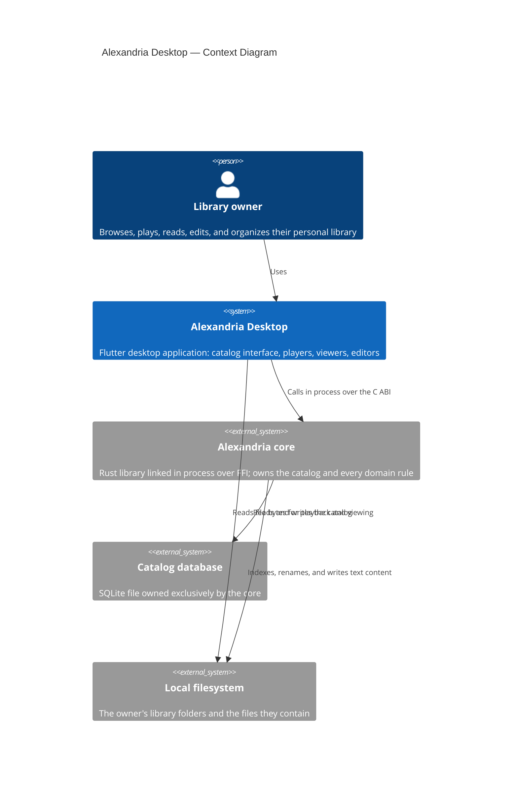
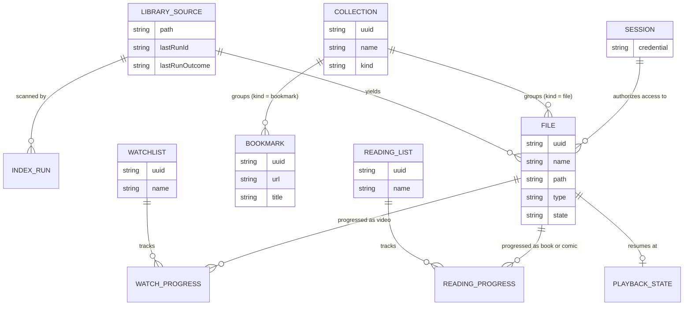
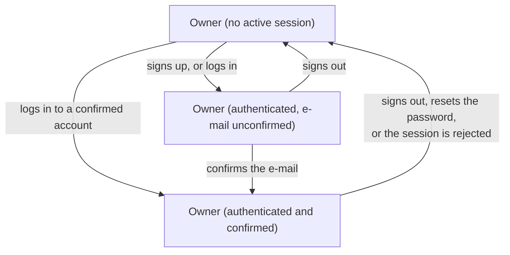

# Vision Document — Alexandria Desktop

## 1. Introduction

### 1.1 Purpose

This document establishes *why* Alexandria Desktop exists, *what* it is, and the
boundaries it will not cross. Alexandria Desktop is the cross-platform desktop
application through which a single person uses their Alexandria library: it
browses the catalog the Alexandria Rust core maintains, plays and reads the files
that catalog points at, edits what is editable, and organizes everything into
collections and tracking lists. It links the core in process over FFI rather than
talking to a server, so the interface and its data live in one local application.
This document states the vision and the features; the concrete requirements are
in the [System Requirements Document](System%20Requirements%20Document.md) and
the technologies in the
[Technology Stack Document](Technology%20Stack%20Document.md).

### 1.2 Scope

Alexandria Desktop covers the whole owner-facing surface of the Alexandria
product: signing the owner up, confirming their e-mail, logging them in and
recovering their password, registering and indexing library folders,
browsing and searching the catalog, playing audio and video, viewing documents,
comics, images and saved pages, editing Markdown and text content, editing music
and video metadata, renaming files, organizing files and bookmarks into
collections, tracking watchlists and reading lists, and carrying out the core's
two-phase deletion lifecycle — all in light and dark themes, in Brazilian
Portuguese and English, on Windows and Ubuntu.

It explicitly does **not** cover:

- **Media editing of any kind.** No audio or video re-encoding, no transcoding,
  no image manipulation. Text content, metadata, names, and organization are the
  only things it changes.
- **Domain logic.** Validation, lifecycle, retention, and every business rule
  belong to the core. The application presents and respects them; it does not
  duplicate or override them.
- **File management.** It does not move, copy, or duplicate files, and it removes
  a file from disk only through the core's explicit purge-on-disk operation.
- **Multi-user capability.** One account, one owner. No second account, no
  sharing, no profiles, no roles.
- **Mail transport.** The application never sends e-mail; the core sends the
  confirmation and recovery messages and owns their tokens entirely.
- **Servers, cloud, or synchronization.** Everything is local to the machine,
  apart from the core's delivery of a confirmation or recovery message.
- **Mobile, web, or macOS builds.**

### 1.3 Definitions and Acronyms

| Term | Definition |
| --- | --- |
| **Alexandria core** | The Rust library that owns the catalog, its database, and every domain rule. Consumed by this application as a bundled shared library over FFI. |
| **Catalog** | The set of records the core maintains about the owner's on-disk files and bookmarks. Metadata and a path plus content hash — never file bytes. |
| **Owner** | The single human user. The only actor with access to any catalog operation. |
| **Library folder** | A directory on disk the owner has registered as a source of files to index. There may be several. |
| **Index run** | An asynchronous scan of a library folder, or a refresh of everything cataloged, started from the interface and observed to completion. |
| **File** | A cataloged on-disk resource, addressed by a public UUID and specialized by type into audio, video, text, document, comic book, HTML page, or image. |
| **Bookmark** | A cataloged browser bookmark pointing at a URL. It has no on-disk file. |
| **Collection** | A named group of files, or of bookmarks, discriminated by its kind. |
| **Watchlist** | A named list tracking the owner's consumption of movies and series, with per-item watch progress. |
| **Reading list** | A named list tracking the owner's reading of books and comic books, with per-item read progress. |
| **Soft delete** | Hiding a record while keeping it restorable. The on-disk file is untouched. |
| **Purge** | Permanently removing a catalog record after its retention window. The on-disk file is untouched. |
| **Purge on disk** | The separate, explicit operation that removes both the record and the physical file. The only operation in the product that deletes the owner's data. |
| **Missing file** | A cataloged record whose on-disk file was not found during the last scan. |
| **Session** | The credential material the core returns at login, held in memory for the run of the application. A session whose account e-mail is unconfirmed is *locked*: it reaches the confirmation screen and nothing else. |
| **Account** | The single owner's credentials and e-mail confirmation state, owned by the core. Created at sign-up; there is never a second one. |
| **Viewer** | A component responsible for presenting one file type — a player, a document reader, or a renderer. |
| **FFI** | Foreign Function Interface: the C ABI through which the application calls the Alexandria core in process. |

---

## 2. Problem Statement

A personal media and document library that lives on disk is unusable through a
file manager. Directories cannot distinguish a movie from a series, cannot
remember which episode was watched last, cannot show what album is playing,
cannot order a reading list, and cannot search across bookmarks, PDFs, and notes
at once. The available alternatives each solve one slice — a music player, a
video player, an e-book reader, a bookmark manager — so the owner runs five
applications over the same directory tree and keeps the organization in their
head. The ones that do more usually demand the opposite trade: import the
library into their own store, re-encode it, or push it to a cloud account.

Alexandria's Rust core already solves the cataloging half of this without any of
those trades. What is missing is a face. Every capability the core exposes is
reachable only from a C ABI or an HTTP client, which means the owner cannot use
their own library at all. That gap is the entire justification for this project:
without a desktop application, the back-end is a well-specified library nobody
can open.

---

## 3. Product Position Statement

| Attribute | Description |
| --- | --- |
| **For** | A person whose music, films, series, books, comics, notes, saved pages, and bookmarks already live on their own disk. |
| **Who** | Wants to browse, play, read, edit, and organize all of it from one place, without importing it into somebody else's store. |
| **The Alexandria Desktop application** | Is a local desktop front-end for a personal library. |
| **That** | Turns an on-disk directory tree into a searchable, playable, trackable library — catalogued by type, organized into collections and tracking lists, and never re-encoded, duplicated, or relocated. |
| **Unlike** | A file manager, or the stack of single-purpose players, readers, and bookmark managers it takes to replace one, or the media servers that require importing the library and running a service to reach it. |
| **Our product** | Runs entirely on the owner's machine with the catalog engine linked in process, treats the files on disk as the source of truth, and never deletes or rewrites one except when the owner explicitly asks. |

---

## 4. Stakeholders

| Stakeholder | Role | Concern |
| --- | --- | --- |
| **The library owner** | The single user, and the only actor with catalog access | That the whole library is reachable, fast, and pleasant from one window — and that nothing on disk changes without them asking. |
| **The Alexandria core project** | The in-process back-end this application drives | That the front-end consumes the published FFI contract as specified, invents no operation the core does not expose, and reports contract gaps back as core work rather than working around them. |
| **The maintainer** | Whoever builds and extends the application | That the architecture absorbs the core's growth — nested collections, richer media capabilities, more file types — as data and registrations, not rewrites. |
| **The packager** | Whoever produces and ships the installers | That one build pipeline yields working Windows and Ubuntu packages with the core's shared library bundled correctly on both. |

---

## 5. High-Level Architecture

The application reads file **bytes** from disk directly, because playback and
rendering need them and the core deliberately never carries them. Everything
*about* a file — its record, its metadata, its lifecycle — travels only through
the core.

---

## 6. Core Features

| ID | Feature | Description |
| --- | --- | --- |
| F-01 | Authentication and session | Sign-up, e-mail confirmation, local login, sign-out, credential change, and password recovery, gating every catalog operation behind an active, confirmed session. |
| F-02 | Library sources and indexing | Registering one or more library folders, starting and observing index runs, refreshing the catalog, and unregistering a folder without losing data. |
| F-03 | Catalog browsing, search, and filtering | A type panel, three view layouts, a detail view, search across the catalog, filters and sorting, and a home dashboard. |
| F-04 | Metadata and content editing | Editing music and video metadata, renaming any file, and editing Markdown and text content in place with a live preview. |
| F-05 | Media playback | A video player with full screen, seeking, subtitle tracks, and audio tracks; an audio player with a queue, resume points, and the album playback animation. |
| F-06 | Document, image, and page viewing | Reading PDFs and e-books, reading comic books, viewing images, and viewing saved HTML pages. |
| F-07 | Collections and bookmarks | Creating, renaming, and deleting collections; adding and removing their members; and managing browser bookmarks within bookmark collections. |
| F-08 | Watchlists and reading lists | Creating and deleting watchlists and reading lists, adding and removing items, and tracking per-episode and per-issue progress. |
| F-09 | Safe deletion lifecycle | Soft deletion, a restorable view of deleted items, record purging after retention, the separate explicit purge-on-disk, and a review of files missing from disk. |
| F-10 | Application shell, theming, and localization | The responsive window shell and navigation, light and dark themes, Brazilian Portuguese and English, and consistent loading and error presentation. |

These `F-xx` identifiers are traced to requirement ranges in
[System Requirements §9](System%20Requirements%20Document.md).

---

## 7. Domain Model Overview

Two things in this model are worth stating rather than leaving to be read off the
diagram.

**Ownership is split, deliberately.** `FILE`, `COLLECTION`, `BOOKMARK`,
`WATCHLIST`, `READING_LIST`, and their progress records belong to the core; the
application holds projections of them and mutates them only through core calls.
`LIBRARY_SOURCE`, `INDEX_RUN`, `SESSION`, `PLAYBACK_STATE`, and the settings are
the application's own. The split is what keeps a single source of truth for the
catalog while still letting the application remember where the library folders
are and where playback stopped.

**Collections are drawn flat and modeled as a tree.** The core stores them flat
today and will support nesting later. The application's navigation, breadcrumbs,
and move interactions are built against a tree whose current depth happens to be
one, so nesting arrives as a change in the data rather than a change in the
interface.

---

## 8. Roles Hierarchy

The system has exactly one kind of actor — the owner — so there is no role
hierarchy to draw. What matters instead is the single boundary between an
authenticated and an unauthenticated application state:

| Role | Relationship to the domain | Permissions |
| --- | --- | --- |
| **Owner (authenticated and confirmed)** | Holds a session the core accepted, for an account whose e-mail is confirmed | Every catalog operation, every library-folder operation, and every application preference. |
| **Owner (authenticated, e-mail unconfirmed)** | Holds a session, but the account is not yet confirmed | The confirmation screen, resending the confirmation, signing out, and the theme and language selectors. The catalog is locked and no catalog call is attempted. |
| **Owner (no active session)** | Has not signed up or logged in, or has been signed out | Sign-up, login, password recovery, and the theme and language selectors. No catalog operation is reachable, and none is attempted. |

---

## 9. Constraints

- **The core is the authority.** The application implements no domain rule of its
  own and calls no operation the core's FFI surface does not expose. A missing
  capability is back-end work, not a front-end workaround.
- **Two platforms, one codebase.** Windows and Ubuntu are both first-class; a
  feature that works on only one is not done. The supported targets are recorded
  in the [Technology Stack Document](Technology%20Stack%20Document.md).
- **In-process, offline, single-user.** No server, no network calls, no
  synchronization, no second user.
- **The disk is the owner's.** The application writes exactly two kinds of thing:
  text-file content the owner saved, and its own local settings. Nothing else it
  does modifies the filesystem, and only an explicit confirmed purge-on-disk
  removes a file.
- **No plaintext credential is persisted or logged**, and the session lives in
  memory only.
- **Both languages and both themes are complete**, always. Neither language is a
  fallback for gaps in the other.
- **Responsiveness is a hard requirement**, not a polish item: every screen stays
  usable from the minimum supported window size to a maximized 4K display.
- **The architecture must absorb the core's growth.** Nested collections, new
  file types, and richer media capabilities are anticipated; each must land as
  data or a registration rather than a restructuring.
- **No media editing**, ever — the product boundary, not a temporary limitation.

---

## 10. Success Criteria

- The owner registers a real library folder, indexes it, finds a file, opens it,
  edits its metadata, and files it into a collection — without leaving the
  application or touching a file manager.
- Music, video, documents, comics, notes, saved pages, images, and bookmarks are
  all reachable from one window and one search.
- A video plays with subtitle and audio-track selection, and an album plays with
  its animation spinning while the audio runs and stopping when it pauses.
- A Markdown file is edited and saved, and the change is visible on disk outside
  the application.
- Every destructive action states what it will remove and whether the on-disk file
  is affected, and no file is ever removed from disk without that confirmation.
- The interface remains usable and unclipped from the minimum supported window
  size upward, and stays responsive while an index run is in flight.
- Every screen reads correctly in Brazilian Portuguese and in English, in both
  light and dark themes.
- The installers produced for Windows and for Ubuntu both deliver the same
  feature set, with the core's shared library loading correctly on each.
- Every failure the core reports reaches the owner as a readable explanation
  rather than a status code or a silent no-op.
